> I would like to express my sincere gratitude to Professor **[Thiago Felippe Kurudez Cordeiro](https://www.linkedin.com/in/thiagocordeiro)**, from the University of Brasília, for his guidance, valuable feedback, and continuous support during the development of this thesis.

> **GitHub**: https://github.com/satsfy/GamaFlyware/

<!-- *“ipse enim dedit mihi horum quæ sunt scientiam veram,  
ut sciam dispositionem orbis terrarum et virtutes elementorum.”  
(vulgatæ editionis, sapientiæ 7:17)* -->

<!-- ## Glossary

- Unmanned Aerial Vehicle
- Simultaneous Localization and Mapping
- PX4 Autopilot Flight Stack
- Mission Management System
- Robot Operating System
- Inertial Measurement Unit
- Guidance, Navigation, and Control
- Visual Odometry
- Visual-Inertial Odometry
- Operating System
- Software-In-The-Loop
- Hardware-In-The-Loop
- Quality of Service
- Real-Time Operating System
- Finite State Machine
- Extended Kalman Filter
- Global Positioning System
- Ground Control Station
- Command Line Interface
- Data Distribution Service

### Formulas and Variables Used

Image captured by the camera at time step \(k\)

Intensity of pixel \((x,y)\) in the image acquired at time \(t\)

Pixel coordinates in the image frame \([\text{px}]\)

Time \([\text{s}]\)

Horizontal and vertical displacements estimated by optical flow \([\text{px}]\)

Rigid-body transformation (6 DOF) from frame \(k-1\) to \(k\) [\(\mathrm{SE}(3)\)]

Rotation component of \(T_{k,k-1}\) [\(\mathrm{SO}(3)\)]

Translation vector of \(T_{k,k-1}\) \([\text{m}]\)

Incremental rigid transform from frame \(n-1\) to \(n\) [\(\mathrm{SE}(3)\)]

Accumulated pose (trajectory) up to time \(n\)

Initial pose (reference condition)

Control error \(e(t)=r(t)-y(t)\)

Reference signal (set-point) of the control system

Measured output of the system

Control signal applied to the actuator

Proportional gain of the PID controller

Integral gain of the PID controller

Derivative gain of the PID controller

Camera focal lengths (in the \(x\) and \(y\) axes) \([\text{px}]\)

Principal point (optical-center coordinates) \([\text{px}]\)

Group of 3-D rigid transformations (rotation + translation)

Group of 3-D rotations

Inertial frame \(\{x,y,z\}\) (North–East–Down)

Body-fixed frame \(\{x',y',z'\}\) attached to the vehicle

Inertial-frame axes \([\text{m}]\)

Body-frame axes \([\text{m}]\)

Full state vector \([\,\mathbf{p},\,\mathbf{v},\,\boldsymbol{\Theta},\,\boldsymbol{\omega}\,]^{\mathsf T}\)

Position of the center of mass in the inertial frame \([\text{m}]\)

Linear velocity \([\text{m}\,\text{s}^{-1}]\)

Euler angles \([\phi,\,\theta,\,\psi]^{\mathsf T}\) \([\text{rad}]\)

Roll, pitch and yaw angles \([\text{rad}]\)

Angular velocity \([p,\,q,\,r]^{\mathsf T}\) in the body frame \([\text{rad}\,\text{s}^{-1}]\)

Body rates about \(x',y',z'\) \([\text{rad}\,\text{s}^{-1}]\)

Vehicle mass \([\text{kg}]\)

Gravity vector \([\text{m}\,\text{s}^{-2}]\)

Rotation matrix (body \(\to\) inertial) built from Euler angles

Total thrust generated by the rotors \([\text{N}]\)

Inertia matrix \(3\times3\) \([\text{kg}\,\text{m}^{2}]\)

Control torque vector \([\tau_\phi,\,\tau_\theta,\,\tau_\psi]^{\mathsf T}\) \([\text{N}\,\text{m}]\)

Torques about \(x',y',z'\) \([\text{N}\,\text{m}]\)

Velocity components (body/inertial as stated) \([\text{m}\,\text{s}^{-1}]\)

Collective thrust command from the altitude loop \([\text{N}]\)

Normalized motor commands (mixer outputs) \([-]\)

EKF process-noise covariance matrix

EKF measurement-noise covariance matrix

-----

/ . – , -

p. : il. (algumas color.) ; 30 cm.  
   

 – , .

  
1\. . 2. . I. . II. Universidade de Brasília. III. Faculdade de Ciências e Tecnologias em Engenharia. IV.  
CDU  

-----

**** -->

<iframe width="560" height="315" src="https://www.youtube.com/embed/UsiFUNniM68" title="YouTube video" frameborder="0" allow="accelerometer; autoplay; clipboard-write; encrypted-media; gyroscope; picture-in-picture; web-share" allowfullscreen></iframe>

## Abstract

The growing demand for autonomous Unmanned Aerial Vehicle (UAV) development is hindered by fragmented toolchains, complex version conflicts and installations, and arduous setup procedures that deter newcomers. This work presents GamaFlyware, an open-source, containerized platform that bundles popular frameworks PX4, Gazebo, ROS 2, and a monocular Simultaneous Localization and Mapping (SLAM) stack into a single, GPU-enabled Docker image for Ubuntu. By pre-configuring every dependency, shipping 44 ready-to-use simulation maps, and embedding a Python-based finite state machine mission manager, GamaFlyware delivers a plug-and-play platform for UAV development. The system can script and fly setpoint missions, explore the environment using SLAM-driven mapping, or execute vision-assisted precision landings. GamaFlyware lowers entry barriers and accelerates experimentation by providing an end-to-end sandbox for future extensions in autonomous UAV applications.

**Key-words**: UAV, SLAM, Simulation, Autonomy, Mission Management System.

# Introduction

GamaFlyware is a simulation platform for autonomous multirotor UAV navigation using computer vision. It is designed to provide an end-to-end development solution for UAV systems, integrating various open-source and author-implemented components.

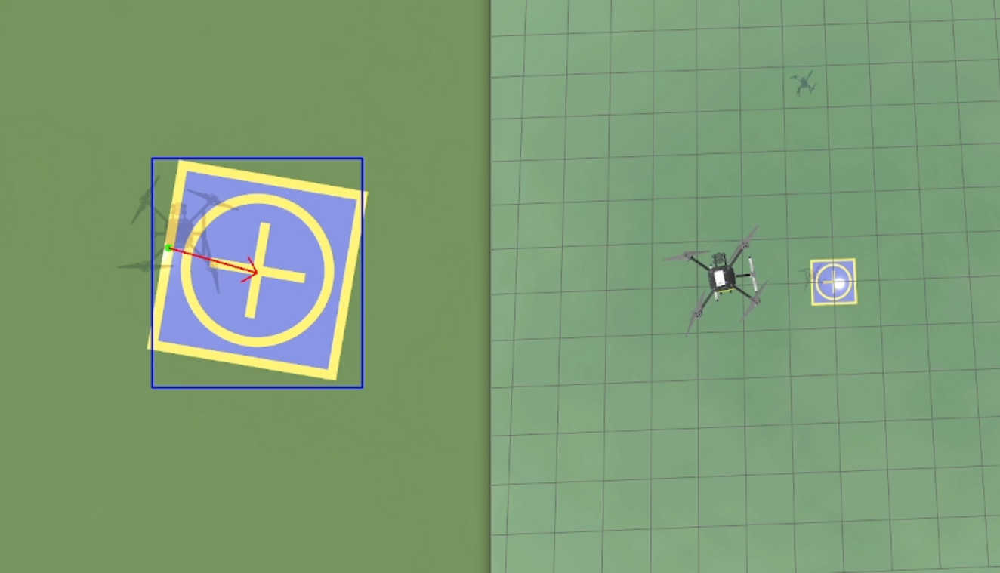
*Figure: GamaFlyware landing an UAV. On the left, the UAV’s camera is highlighting the landing site. On the right, the simulated UAV in Gazebo.*

## Context and Motivation

With each new use case, Unmanned Aerial Vehicle (UAV) technology emerges as an indispensable asset across all facets of society. Institutions now deploy UAVs for agriculture, infrastructure inspection, emergency response, delivering meals, inspecting power lines, or transporting medical supplies to remote clinics. UAVs have been used for herding livestock across vast ranches, wildfire mapping, search-and-rescue operations, or weaponized for land, naval, and air military operations.

In the last decade, multiple research papers exploring this topic have been published: developing long‐distance UAV missions using eSIM and antenna-tower communications [1](#ref-1), routing networking communications in deep valleys without radio or satellite [2](#ref-2), or modeling complex urban delivery scenarios and blockchain-backed last-mile logistics, as in [3](#ref-3), visual perception missions such as navigation and inspection of unfamiliar, maze-like indoor structures [4](#ref-4), dynamic obstacle tracking of moving objects [5](#ref-5), or large-scale surveillance missions to identify points of interest in real time [6](#ref-6). Simulated environments can support multiple UAVs (a UAV swarm, according to [7](#ref-7)) enabling tests of formation flights, collision-avoidance strategies, coordinated mission planning, and mixed-fleet interactions, as in [8](#ref-8). Further possibilities range from cybersecurity research—such as probing communication vulnerabilities for hijacking control of flying UAVs [9](#ref-9)—to staging virtual air-to-air combat between autonomous UAVs to benchmark real-time maneuvering and adversarial decision-making [10](#ref-10).

Additionally, UAVs have become a powerful catalyst for education and innovation, engaging students and early-career engineers in hands-on projects spanning software development, electronics, and aerospace, while startup incubators and maker spaces harness UAVs to spawn new economic niches. Universities can leverage UAV platforms to teach programming, control theory, and computer vision in a real-world context. In hackathons or competition teams, the immediacy of feedback—success or spectacular failure—fuels a problem-solving mentality and builds resilience. UAV technologies can help nurture the next generation of scientists, entrepreneurs, and engineers.

In the University of Brasília’s Faculdade de Ciência e Tecnologia, the competition team Equipe de Robótica Aérea (EDRA) has been involved in multiple UAV competitions such as [11](#ref-11), [12](#ref-12), or [13](#ref-13) (backed by [14](#ref-14)), highlighting a growing demand for technical expertise in UAV technology.

## Problem Statement

Despite the increasing availability of open-source libraries, as UAV applications proliferate, potential developers may still struggle to find a straightforward, open-source, end-to-end simulation platform that unites the most widely adopted UAV technologies with modern programming languages and an open, extensible architecture. Even piecing together state-of-the-art tools often entails wrestling with dependency conflicts, fragmented documentation, and steep learning curves.

## Research Question

How to build an autonomous multirotor simulation platform that supports diverse mission-driven scenarios by integrating open-source libraries?

## Objectives

### General Objective

To create an open-source, modular Software-In-The-Loop simulation platform for autonomous multirotor UAVs for diverse mission-driven flight scenarios that lowers the barrier of entry into UAV development.

### Specific Objectives

  - Integrate a full simulation stack using popular open-source tools PX4, ROS, and Gazebo.

  - Integrate a SLAM (see [Slam](#slam)) library to enable autonomous perception guidance.

  - Design and implement a suite of representative mission scenarios to demonstrate the system’s potentialities.

  - Package the entire environment into a reproducible plug-and-play containerized implementation with documentation.

  - Ensure the system supports a transition to physical UAV platforms.

## Structure and Organization of the Work

  - **Chapter 1: Introduction** – Provides an overview of the research context, problem statement, objectives, and structure of the work.

  - **Chapter 2: Theoretical Foundations** – Explores the theoretical background related to UAVs, autonomy, navigation, computer vision, mission management, SLAM, and simulation systems, offering the necessary context for understanding the proposed solution.

  - **Chapter 3: Materials and Methods** – Details bibliography and related works.

  - **Chapter 4: Development** – Describes the solution.

  - **Chapter 5: Results** – Presents the integrated platform and developed mission scenarios.

  - **Chapter 6: Conclusion** – Summarizes the key findings of this work, discusses challenges and limitations, and suggests potential directions for future development.

# Theoretical Foundations

A fundamental source of information for this work was the books *Introduction to multicopter design and control* by [15](#ref-15) and *Handbook of Unmanned Aerial Vehicles* by [16](#ref-16), which provides a comprehensive overview of the principles and technologies underlying UAVs.

## Unmanned Aerial Vehicle

An Unmanned Aerial Vehicle (UAV), commonly referred to simply as a drone or Unmanned Aerial System (UAS), is an aircraft that operates without a human pilot onboard. [15](#ref-15) identifies three types of UAVs that are commonly used: fixed-wing, in which the wings are permanently attached to the airframe of the aircraft; single-rotor-blade helicopter, a type of rotorcraft in which lift is supplied by rotors directly; and multirotors, which have three or more propellers. According to [17](#ref-17), the multirotor’s flight, in specific, is capable of VTOL (Vertical Take-Off and Landing) and show outstanding maneuverability, stability, and hover performance. These flight capabilities make multirotor UAVs suitable to perform a wide array of tasks such as hazardous labor, search and rescue, infrastructure inspection, military or security activities, remote sensing, reconnaissance, or surveillance [18](#ref-18), [19](#ref-19), [20](#ref-20)

A UAV is composed of an airframe that holds all parts together, a propulsion system which powers the aircraft and a command-and-control system. The command and control system may include an autopilot microcomputer (flight controller), an RC transmitter and receiver, a general microcomputer with a Wi-Fi motherboard, and a ground station.

It may have a combination of sensors dedicated to locating itself in the environment, such as a GNSS receiver (Global Navigation Satellite System, such as GPS or GLONASS), an IMU (Inertial Measurement Unit), LiDAR (Light Detection and Ranging), a barometer (for altitude), a 2D laser range finder, an ultrasonic range finder (for distance to the ground or to nearby obstacles), positioning beacons, and cameras.

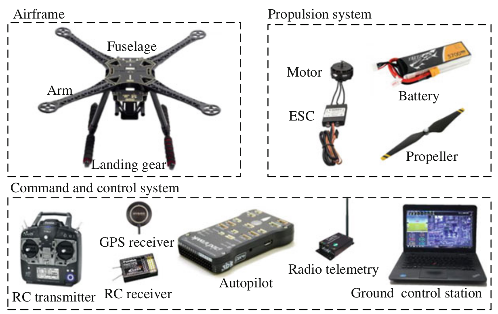
*Figure: The parts of a multicopter - Obtained from [15](#ref-15).*

Multiple types of cameras can be used. Monocular cameras capture a single 2D image at each time interval with colors, commonly red, green, and blue, from a certain viewpoint. Stereo cameras capture 2 images (called left and right) at each time interval, separated by a known fixed distance apart [21](#ref-21). A depth camera often has a conventional camera, an infrared laser projector, and an infrared camera. The infrared projector projects an invisible infrared light grid onto the scene, which is recorded in order to compute the depth information. Further discussion of UAV camera applications can be found in section [Computer Vision](#computer-vision).

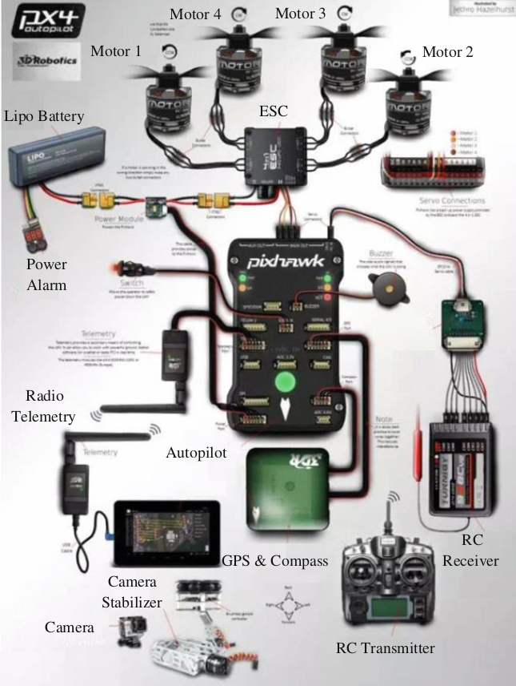
*Figure: Components and connections of a multicopter - Obtained from [15](#ref-15).*

The autopilot (or flight controller) is responsible for interpreting sensor data and sending signals for the motors, which rotate at variable speeds, each generating some thrust. A multirotor is uncontrollable by a human without the aid of an autopilot due to the inherent instability of multirotor systems, which rely on precise and rapid adjustments (control feedback, see Section [Control](#control)) of motor speeds to maintain stability and control. These systems read sensors, measure and calculate the UAV’s orientation and position, use algorithms to adjust the motor speeds in real-time to stabilize the UAV, execute pilot commands, hover in place, and maintain its position mid-air with precision.

Frequently, multicopter UAVs come equipped with powerful single-board microcomputers (such as Raspberry Pi, NVIDIA Jetson Nano, or BeagleBone Black) running general operating systems such as Linux Ubuntu. These computers run as supplementary to the main autopilot microcontroller, which interfaces with the hardware in real-time, such as a PIXHAWK flight controller running the software called PX4 autopilot. A multicopter may have, for example, an inner-loop controller at a higher rate to stabilize roll, pitch, and yaw, and an outer-loop at a lower rate to track position. This setup enhances the capabilities of the UAV by permitting any software to run on board. There may be various types of software embedded in a UAV:

| **Section** | **Software Type** | **Description**   |
| - | - | - |
| [guidance](#guidance) | Guidance | Implements setpoint tracking, return-to-home, and autonomous route execution.   |
| [navigation](#navigation) | Navigation | Performs sensor fusion with GPS, IMU, and visual data for precise position/orientation tracking.   |
| [control](#control) | Control | Manages flight dynamics through controllers and stabilization algorithms.   |
| [uav](#uav-communication) | Telemetry | Wireless transmission of flight parameters and system status.   |
| [uav](#uav-communication) | Communication | Protocol management for UAV–ground station data exchange.   |
| [guidance](#guidance) | Path-planning | Generates collision-free trajectories.   |
| [mms](#mission-management-system) | Mission Management System | Orchestrates flight sequences and task automation.   |
| [mapping](#mapping) | Mapping | Creates 2D/3D map models from aerial imagery.   |
| [Uav Communications](#uav-communication) | Video streaming | Encodes/transmits live camera images with low latency.   |

In the framework of [22](#ref-22), a mission is defined as a predefined set of objectives or tasks that the system must complete within a given environment and under specific constraints. A task is defined as a set of coordinated actions executed to satisfy an objective. A state refers to a particular situation within a task, characterized by the actions performed and the observations received, such as take-off or transit to the mission area. A transition denotes the change from one state to another when specified conditions are met (for example, emergency mode on low battery). A payload is any equipment, sensor, or device carried by a UAV that is not essential for flight but is used to accomplish specific mission objectives. An action is a UAV maneuver or payload operation, such as flying to a setpoint or capturing an image. Finally, an observation is information that informs state changes (such as "is altitude above 10 meters").

Some typical tasks performed by UAVs include surveillance, which involves the systematic overflight of an area to detect objects or events; mapping, which employs similar flight patterns to generate spatial representations of the environment; or tracking, which requires following moving targets continuously.

A system is a set of components that interact with each other to achieve a goal. According to [23](#ref-23), decision-making can be defined as the capacity of sensing, interpreting, and acting upon unexpected or unknown changes in the environment.

Autonomy, according to [24](#ref-24), refers to a system’s ability to sense its environment and make decisions to achieve goals without human intervention. In contrast, a purely automatic system simply executes pre-programmed commands (e.g., flying a fixed route regardless of conditions). An intelligent system operates effectively in uncertain environments by selecting actions that maximize the likelihood of success—achieving sub-goals aligned with its ultimate objective. Unlike automatic systems that rigidly follow preset instructions without decision-making abilities, autonomous systems can perceive varying conditions and make informed decisions accordingly.

UAV autonomy is generally classified into three levels—fully human-operated, semi-autonomous, and fully autonomous—with increasing degrees of intelligent decision-making at each level. The human-operated flight may be controlled using a Remote Control (RC), while semi-autonomous flight uses a Ground Control Station (GCS).

A fully autonomous UAV should be capable of considering both its position and its environment to properly respond to unexpected or dynamic circumstances, as mentioned by [25](#ref-25). It must localize itself within a map, plan safe paths using prior environmental data, and dynamically replan as conditions change. This requires situational awareness—such as knowing its position, recognizing obstacles, and predicting future states—and runs onboard algorithms for real-time path planning and trajectory generation (see section [Guidance](#guidance)). Autonomy also includes handling contingencies. A fully autonomous UAV is a robot.

As autonomy levels increase, UAV software must handle a growing range of tasks, from simple flight stabilization to complex high-level navigation (see [Navigation](#navigation)) and mission planning (see [MMS](#mms)). Autonomous UAVs use onboard sensors and computation to interpret their environment and achieve goals without manual control. The software implementation of an autonomous UAV is discussed in section [MMS](#mms).

## Guidance, Navigation, and Control

Autonomous flight is structured around three interdependent layers: Guidance, Navigation, and Control (GNC). Control (Section [Control](#control)) asks, "How to move the aircraft to get there?" determining the low-level action loop, translating high-level commands into real-time motor inputs that stabilize attitude, regulate altitude, and track desired velocities. Navigation (Section [Navigation](#navigation)) answers the question “Where are we now?” by estimating the vehicle’s state from onboard sensors and external aids. Guidance (Section [Guidance](#guidance)) determines, “Where should we go, and how do we get there?” by planning collision-free paths and time-feasible trajectories that honor environmental constraints and vehicle dynamics (see [Frames Dynamics](#frames-dynamics)).

### Frames, Attitude, and Dynamics

As shown in [15](#ref-15), understanding the motion of a multirotor requires a precise description of its position and orientation relative to a fixed reference. There are two coordinate frames: an inertial frame fixed to the Earth and a body-fixed frame attached to the vehicle. The position and velocity are expressed in the inertial frame, while angular velocity and control inputs are most naturally described in the body frame. Attitude (orientation) is represented by a sequence of three Euler angles—roll, pitch, and yaw—which describe the orientation of the body frame relative to the inertial frame. With this framework in place, the translational and rotational dynamics of the vehicle can be derived from Newton–Euler principles, leading to a compact six-degree-of-freedom model. This work regards the multicopter as a rigid body.

Two right-handed reference frames are used, consistent with standard multirotor conventions. The inertial frame \(\mathcal{I} = \{x, y, z\}\) is fixed to the Earth and follows a North–East–Down (NED) orientation. The body-fixed frame \(\mathcal{B} = \{x', y', z'\}\) is attached to the multirotor, with \(+x'\) pointing forward, \(+y'\) to the right, and \(+z'\) downward. This body frame moves and rotates with the vehicle and is used to express angular velocities and control inputs. See Figure [Figure](#fig-lol2) for a visual representation of the two frames and the associated roll–pitch–yaw angles.

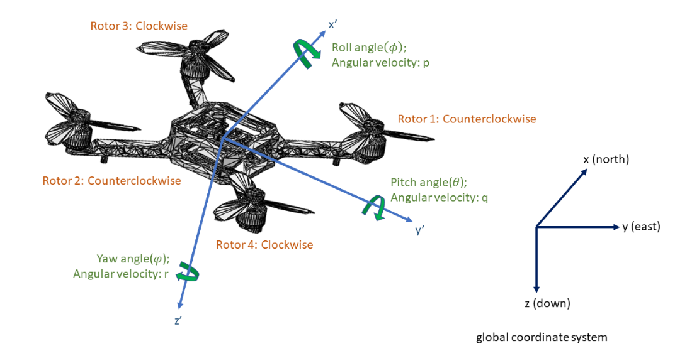
*Figure: Quadrotor reference frames. The body-fixed axes \((x',y',z')\) rotate with the vehicle; roll (\(\), rate \(p\)) is about \(x'\), pitch (\(\), rate \(q\)) about \(y'\), and yaw (\(\), rate \(r\)) about \(z'\). Rotors 1 and 2 spin counter-clockwise, while rotors 3 and 4 spin clockwise, generating the torques that realize these rotations. The inertial North–East–Down frame \((x,y,z)\) is shown at right for global reference.*

The state of a rigid multirotor can be compactly represented by the vector \(\mathbf{x} = [\, \mathbf{p},\, \mathbf{v},\, \boldsymbol{\Theta},\, \boldsymbol{\omega} \,]^T\), where \(\mathbf{p} \in \mathbb{R}^3\) is the position of the center of mass in the inertial frame, \(\mathbf{v} = \dot{\mathbf{p}}\) is the linear velocity, \(\boldsymbol{\Theta} = [\phi,\, \theta,\, \psi]^T\) are the roll, pitch, and yaw Euler angles, and \(\boldsymbol{\omega} = [p,\, q,\, r]^T\) is the angular velocity expressed in the body frame. Here, \(p\), \(q\), and \(r\) represent angular rates about the \(x'\), \(y'\), and \(z'\) axes, respectively. The translational dynamics are governed by Newton’s second law, \(m \dot{\mathbf{v}} = m \mathbf{g} + R(\boldsymbol{\Theta}) [0\;0\;-T]^T\), where \(T\) is the total thrust generated by the rotors and \(R(\boldsymbol{\Theta})\) is the rotation matrix from the body frame to the inertial frame. This thrust vector is always aligned with the negative \(z'\) axis.

### Control

Control is the low-level layer that turns guidance decisions into physical motion. It translates high-level commands (“pitch forward,” “hold altitude,” etc.) into precise motor commands. It generates thrusts and torques by rapidly varying each rotor’s speed based on gyroscope and accelerometer feedback, keeping the vehicle stable and responsive despite gusts, payload shifts, or sensor noise. Running at high rates and interfacing directly with sensors and motors, control delivers the split-second corrections needed for robust flight, freeing navigation and guidance to focus solely on higher-level mission objectives.

A full treatment of control theory and control systems is beyond this work (see [26](#ref-26)), but an illustrative example of the most common control algorithm used in UAVs is the Proportional–Integral–Derivative (PID) controller. Figure [Figure](#fig-pid) shows the structure of a PID controller, a feedback control loop widely used in UAVs due to its simplicity and reliability, as mentioned by [27](#ref-27). The controller receives a reference input \(r(t)\) (containing IMU readings, for example) and compares it to the measured output \(y(t)\) (motor drive, for example) to compute the error \(e(t) = r(t) - y(t)\). This error is then processed in three parts:

  - The *proportional* term, \(K_p e(t)\), reacts instantly to the current error;

  - The *integral* term, \(K_i \int_0^t e(\tau)\,d\tau\), eliminates long-term steady-state error;

  - The *derivative* term, \(K_d \frac{de(t)}{dt}\), predicts future trends and adds damping.

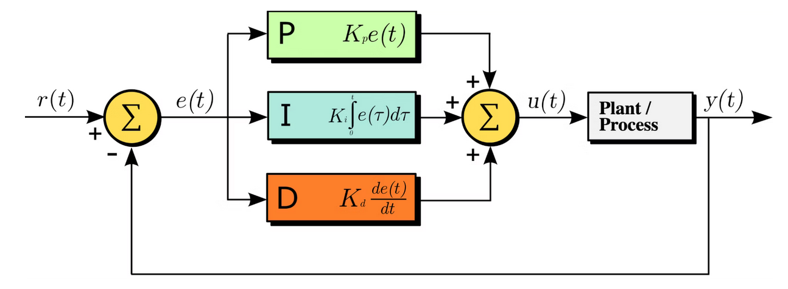
*Figure: The PID regulator - Obtained from [28](#ref-28).*

These contributions are summed to form the control signal \(u(t)\), which drives the plant. The output \(y(t)\) is then fed back, closing the loop. Figure [Figure](#fig-cascade-control) shows the cascaded structure used in the PX4 quadrotor flight stack.

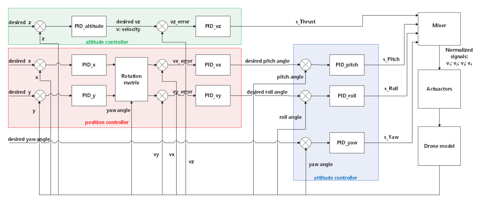
*Figure: Cascaded quadrotor controller. Altitude, horizontal position, and attitude are regulated by nested PID loops. The mixer converts the resulting thrust/torque demands into four motor signals \(v_1\!:\!v_4\) - Obtained from [29](#ref-29).*

  - **Altitude loop** (green). A PID on the vertical position \(z\) computes a desired vertical speed \(v_z\). A second PID on \(v_z\) outputs the collective thrust \(\tau_{\text{Thrust}}\).

  - **Horizontal-position loop** (red). Independent PIDs on \(x\) and \(y\) produce desired body‐frame velocities \(v_x\) and \(v_y\). A rotation matrix (built from the current yaw angle) converts these commands into the inertial frame; PIDs on the velocity errors then output *desired* pitch and roll angles.

  - **Attitude loop** (blue). Three PIDs track the commanded pitch, roll, and yaw angles delivering the torque commands \(\tau_{\text{Pitch}}\), \(\tau_{\text{Roll}}\) and \(\tau_{\text{Yaw}}\).

The four thrust signals are passed to the *mixer*, a static matrix that translates them into four normalized motors commands \(v_1\!:\!v_4\). These commands drive the electronic speed controllers. which in turn adjust the propeller speeds. Running the inner attitude loop at a higher frequency and the outer position/altitude loops at a lower gives the vehicle the bandwidth it needs to reject wind gusts and track the user commands smoothly.

### Navigation

Navigation is the process of determining the vehicle’s state—its position, velocity, and orientation—over time. It does so by state estimation, the process of determining the state of a system from noisy measurements.

Pose comprises the six-degree-of-freedom state of a vehicle, defined by its position coordinates \((x,y,z)\) and its orientation angles (\(\psi\) yaw, \(\theta\) pitch, and \(\phi\) roll). See figure [Figure](#fig-lol2). Odometry estimates the change in pose—and, by integration, the corresponding velocity—using raw measurements from onboard sensors. Chaining these incremental estimates over time yields a continuous navigation solution, which provides the UAV trajectory in three-dimensional space. Guidance (see [Guidance](#guidance)) then consumes this navigation solution. Localization denotes the real-time process of estimating position on board the UAV, whereas positioning refers to the algorithms, sensors, and external infrastructure that enable that estimation. Ground truth denotes the reference pose obtained from independent, high-precision measurements against which the performance of navigation algorithms is assessed.

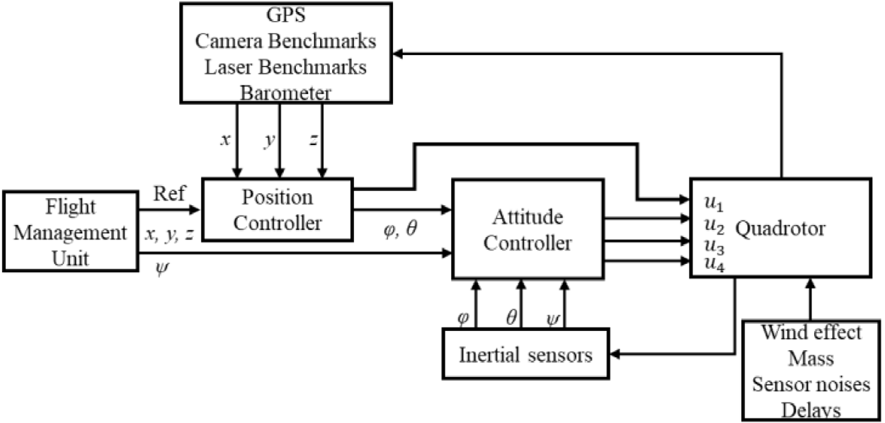
*Figure: Navigation Control Loop - Obtained from [19](#ref-19).*

No single sensor provides both high bandwidth and long-term stability under all environmental conditions; therefore, UAVs integrate multiple sensors: cameras, IMUs, barometers, magnetometers, altimeters, LiDAR, GPS receivers, etc. The system employs sensor fusion to reconcile these asynchronous, noise-corrupted measurements into a unified state estimate. According to [15](#ref-15), the Extended Kalman Filter (EKF) is an efficient recursive filter that estimates the internal state of a linear dynamical system from a series of noisy measurements. It serves as a common fusion framework: it propagates the previous state through a motion model (prediction) and then updates that propagated state using new sensor readings (correction), weighting each observation by its modeled uncertainty. Explaining EKF in depth lies outside the scope of this work; more is available in [30](#ref-30). Because the accuracy of guidance depends on the fidelity of navigation, researchers such as [31](#ref-31), [32](#ref-32), pursue low latency in state estimation systems.

According to [33](#ref-33), Visual Odometry (VO) tracks image features between successive camera frames. A definition of the visual odometry problem can be found in the section [Vo Prob](#vo-prob). By using monocular cameras for VO, the solution cannot recover absolute scale between image elements and may perform poorly in textureless or high-dynamic-range environments. Inertial odometry (IO) integrates specific force and angular-rate measurements from IMUs to estimate velocities, positions, and orientation changes, as in [34](#ref-34). Although IO offers high temporal resolution and immunity to lighting conditions, the double integration of sensor noise and bias leads to unbounded error propagation (called drift) without external correction. Visual–inertial odometry (VIO) mitigates this drift by combining VO and IO, improving robustness, as in [35](#ref-35). Nonetheless, VIO still accumulates drift that must be corrected further.

External positioning systems can eliminate drift entirely. GPS receivers compute absolute position by triangulating signals from satellite constellations. Indoors, ultra-wideband or acoustic beacon networks [36](#ref-36) achieve meter- to centimeter-scale accuracy, and motion-capture systems with infrared cameras and retro-reflective markers [37](#ref-37) provide sub-millimeter precision. However, these systems depend on infrastructure that may be unavailable or impractical to deploy: urban canyons attenuate satellite signals, industrial environments may preclude beacon installation, and motion-capture systems require controlled volumes [38](#ref-38).

In environments without external positioning systems, UAVs must rely solely on their own internal, local sensing modalities—IO, VO, VIO, LiDAR odometry, or visual perception—to maintain state estimates and ensure stable flight [38](#ref-38). When global measurements become available, fusion pipelines incorporate them as additional observations, blending them with local estimates to constrain long-term drift without compromising short-term responsiveness [39](#ref-39).

#### Visual Odometry Problem

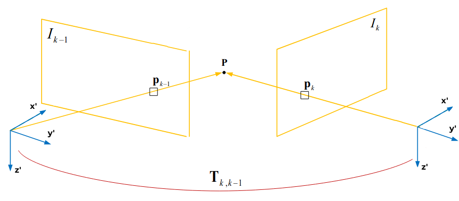
*Figure: Visual Odometry problem - Obtained from [33](#ref-33).*

The visual odometry problem (Figure [Figure](#fig-voprob)) addresses the challenge of estimating a camera’s trajectory by processing a sequence of images. [33](#ref-33) formalizes it as:

  - \(I_k\): the image captured by the monocular camera at time step \(k\).

  - \(T_{k,k-1}\in \mathrm{SE}(3)\): the \(4\times4\) rigid‐body transform mapping coordinates from frame \(k-1\) to frame \(k\).

  - \(R_{k,k-1}\in \mathrm{SO}(3)\): the \(3\times3\) rotation matrix component of \(T_{k,k-1}\).

  - \(t_{k,k-1}\in \mathbb{R}^3\): the translation vector component of \(T_{k,k-1}\).

  - \(C_n\): the cumulative pose at time \(n\), obtained by chaining successive transforms, with \(C_0\) the known initial pose.

At time \(k\), a monocular camera captures an image \(I_k\) from which VO seeks to determine the rigid transformation. [T_{k,k-1} = \begin{bmatrix} R_{k,k-1} & t_{k,k-1} \\ 0 & 1 \end{bmatrix},] that relates the camera pose at time \(k-1\) to that at time \(k\). By successively estimating these incremental transformations, the full trajectory \(C_{0:k}\) is reconstructed via [C_n = C_{n-1} T_n,] with \(C_0\) as the initial pose.

Solutions for the visual odometry problem will be shown in section [Computer Vision](#computer-vision).

### Guidance

Guidance is the decision-making layer that determines the desired trajectory of the UAV, based on its current state and mission goals. It answers the question of where the vehicle should go next and how to reach that destination while avoiding obstacles and respecting flight constraints. As described by [40](#ref-40), guidance typically comprises two main components: path planning and trajectory generation. Path planning defines a collision-free route through the environment, while trajectory generation transforms that route into a time-parameterized plan that accounts for vehicle dynamics. The output of the guidance system is passed to the control layer, which ensures the UAV follows the intended path.

In simple environments, guidance may interpolate between straight-line setpoints and rely on PID control for execution. More sophisticated planners handle cluttered or dynamic spaces by modeling the environment with occupancy grids (see [Slam](#simultaneous-localization-and-mapping)), then applying search algorithms such as A\*, D\*, or RRT\* to compute valid paths. Once a geometric path is found, trajectory generation refines it into a smooth sequence of time-indexed states and control inputs that respect physical constraints like velocity, acceleration, or rate of change of acceleration. These trajectories provide dynamically feasible references for the control system to track with precision [24](#ref-24), [31](#ref-31), [32](#ref-32).

## Computer Vision applied to UAVs

For [35](#ref-35), perception encompasses the sensing and interpretation of the environment to construct an internal model. Computer vision provides the perceptual capabilities required for mission execution, navigation (see [Navigation](#navigation)) and guidance (see [Guidance](#guidance)), enabling UAV autonomy. By processing the raw image stream from onboard cameras (see [Image Acquisition](#image-acquisition)), vision algorithms supply estimates of motion, build and refine environment maps (see [Mapping](#mapping)) or detect objects of interest (see [Mlcv](#mlcv)).

One important challenge for UAV computer vision is solving visual odometry (see [Vo Prob](#vo-prob)), because using a live camera feed for VO is not a trivial problem. Multiple solutions have been created to solve it, [41](#ref-41) presents: Feature-based methods (see [Visual Features](#visual-features)) detect and track salient points across frames to estimate inter-frame motion, while direct methods leverage pixel-intensity constancy to generate dense optical-flow fields (see [Optical Flow](#optical-flow)). Hybrid approaches, such as semi-direct visual odometry, combine these strategies to balance efficiency and accuracy. These techniques often form the front end of Simultaneous Localization and Mapping (SLAM, section [Slam](#simultaneous-localization-and-mapping)), where motion estimates are used to incrementally construct and update spatial representations. These outputs feed the navigation and guidance pipeline, as per [33](#ref-33).

### Image Acquisition and Preprocessing

Image acquisition and preprocessing form the first stage of a vision pipeline. Cameras mounted on UAVs capture raw image frames, typically in RGB or grayscale formats, at a fixed rate determined by the onboard hardware. Frames often contain distortions due to lens imperfections, rolling shutter effects, or motion blur. Preprocessing steps correct for these effects; for example, geometric undistortion compensates for radial and tangential lens distortions, or photometric normalization adjusts contrast or brightness to mitigate lighting variation. Images may also be downsampled to reduce processing load or converted to alternative color spaces to simplify computations. Libraries such as [42](#ref-42) provide efficient tools for these operations, enabling real-time processing on UAV platforms. The goal of this stage is to produce clean, consistent image data for later stages of the computer vision pipeline [43](#ref-43).

#### Camera calibration

Camera calibration, as in [44](#ref-44), is required to extract accurate geometric information from images. It estimates the camera’s intrinsic parameters (e.g., focal length, principal point, lens distortion) and extrinsic parameters (camera pose relative to a reference frame), which are used during undistortion and rectification. These parameters are critical for metric accuracy in tasks such as triangulation, depth estimation, and SLAM (see [Slam](#simultaneous-localization-and-mapping)). Calibration is typically performed offline using known patterns and toolkits such as Kalibr, by [45](#ref-45), or [46](#ref-46)’s camera\_calibration. The process involves capturing multiple images of a calibration target (e.g., a checkerboard) from different angles, then solving for the camera parameters that minimize reprojection error. Figure [Figure](#fig-calibration) presents a simulated camera being calibrated.

#### Visual Features

Visual features are localized patterns in an image—such as corners, edges, or textured regions—that can be identified and compared across frames. They provide a compact representation of scene structure, useful for tasks like motion estimation, mapping, and recognition. Extracted from pixel intensity variations, these features allow systems to associate image content over time and under different viewpoints.

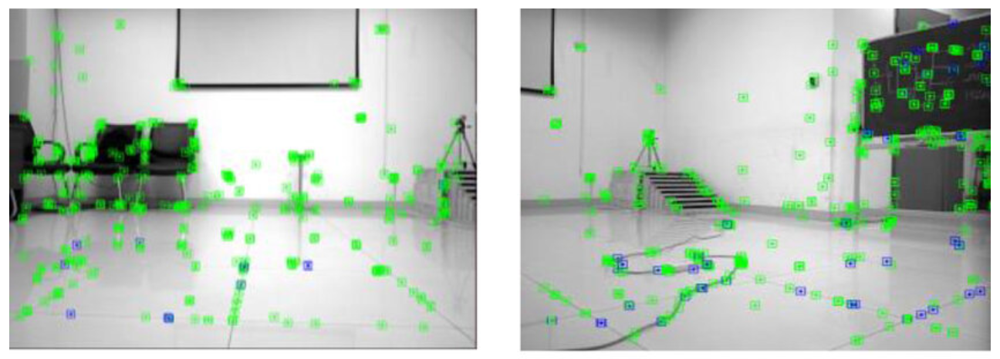
*Figure: ORB visual features detected in 2 images - Obtained from [47](#ref-47).*

According to [41](#ref-41), early methods like the Harris corner detector provided rotation invariance but lacked robustness to scale changes. As in [48](#ref-48), SIFT addressed this by introducing both scale and rotation invariance, using Difference of Gaussians for keypoint detection and orientation histograms for descriptor construction. SURF accelerated these computations with integral images and box filters. FAST offered real-time corner detection by comparing pixel intensities around a circular neighborhood, and when paired with BRIEF, yielded efficient binary descriptors. ORB built upon FAST and BRIEF, adding orientation estimation and improved descriptor variance, making it well-suited for resource-constrained platforms. These methods balance invariance, speed, and descriptiveness.

### Optical‐Flow Visual Odometry

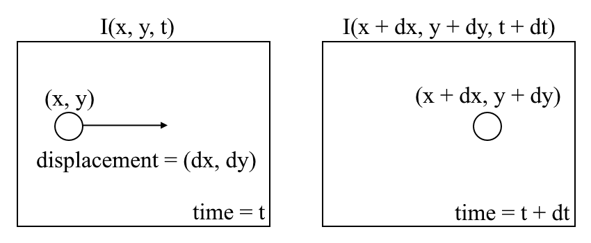
*Figure: Optical Flow problem definition - Obtained from [49](#ref-49).*

As [49](#ref-49) defines it, optical flow is a mathematical image processing algorithm that compares pairwise changes from images with succeeding images in time. The match that requires the least friction in pixel color intensity generates a direction vector with magnitude (see Figure [Figure](#fig-opticalfl)). The UAV movement can be stabilized by opposing the vector generated with control commands and proper calibration. Optical flow may also use corners, edges, or any other notable visual feature (see [Slam](#simultaneous-localization-and-mapping)).

  - \(I(x,y,t)\): Image intensity at pixel \((x,y)\) in the frame captured at time \(t\).

  - \(\Delta x, \Delta y\): Horizontal and vertical displacements of that pixel between frames.

### Mapping

Mapping is the process of constructing spatial representations of the environment from sensor data, enabling UAVs to perceive and plan. They range in complexity depending on onboard resources and task requirements.

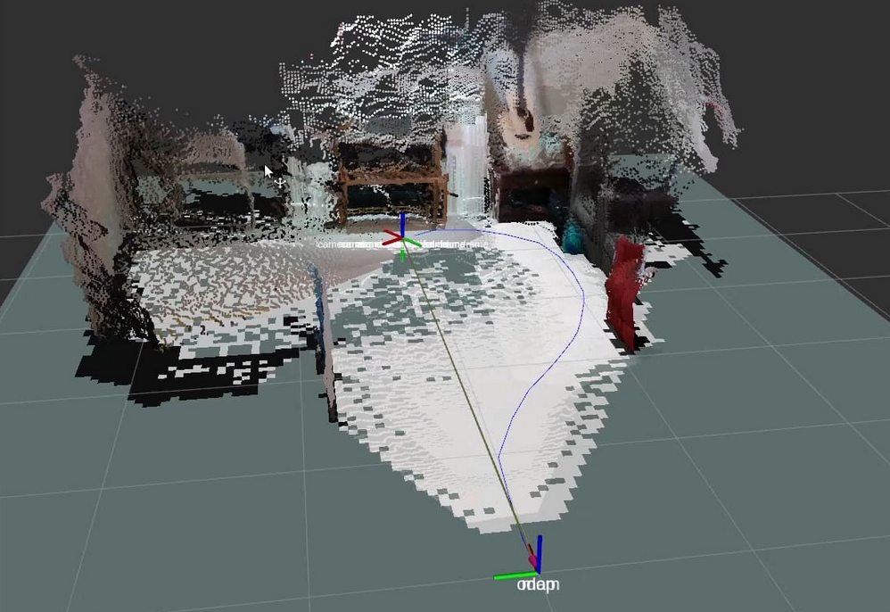
*Figure: 3D map created by RTAB-MAP library - Obtained from [50](#ref-50).*

In accordance with [51](#ref-51), sparse maps use triangulated visual features as discrete landmarks, offering lightweight localization but limited surface detail. In [52](#ref-52), dense maps represent environments as spatial samples, typically in the form of point clouds (an unordered collection of points in space), and require filtering to reduce noise and redundancy. To model free and occupied space, as mentioned by [53](#ref-53), occupancy grids divide the environment into fixed-size cells marked as occupied, free, or unknown. In 3D, these become voxel grids, but memory use scales poorly. [54](#ref-54) presents Octomaps to address this via hierarchical octrees, enabling adaptive resolution and efficient 3D access for planning and avoidance. Semantic maps, in [55](#ref-55), fuse geometry with high-level labels like “tree” or “building,” derived from image classifiers or segmentation networks for richer scene understanding and goal-driven reasoning.

### Simultaneous Localization and Mapping

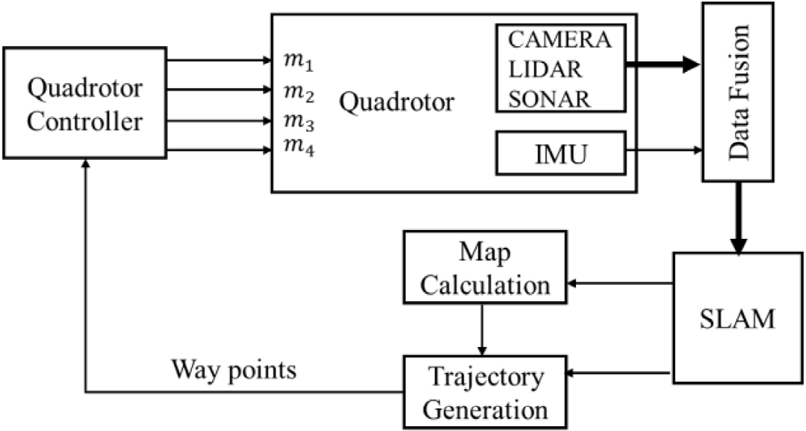
*Figure: SLAM control loop - Obtained from [19](#ref-19).*

Simultaneous Localization and Mapping (SLAM), as in [41](#ref-41), [19](#ref-19), builds a map of an unknown environment while concurrently estimating the UAV’s pose in real time, supplying fundamental navigation and perception functions for autonomous flight. SLAM uses depth sensors and IMUs for pose accuracy. Implementations range from 2D to richer—but more computationally intensive—3D variants.

SLAM may use various camera types. Stereo and RGB-D cameras are used frequently because they integrate depth sensors to capture three-dimensional information [41](#ref-41). Monocular cameras provide simplicity and low cost but face ambiguity in determining the scale between detected elements because they cannot directly measure depth. This limitation leads to scale drift that can reduce accuracy [35](#ref-35). As in [31](#ref-31), despite the complications, monocular systems remain in usage for SLAM implementations in robotics and UAVs.

Several SLAM libraries support monocular configurations, as surveyed in [41](#ref-41), each with varying requirements for IMU integration. ORB-SLAM3 offers monocular support and can optionally use IMU data to enhance performance. RTAB-Map has an easy-to-use implementation and uses an occupancy grid map. VINS-Fusion, VINS-Mono, OpenVINS, and Kimera require IMU data for their operations, while LSD-SLAM operates without it. These and various other libraries provide a range of options for implementing SLAM in UAV systems, depending on the specific requirements and available hardware.

The popular library ORB-SLAM3, presented by [56](#ref-56), has been selected as the reference implementation for this work. It includes dependencies like Pangolin for managing OpenGL rendering and user interface and Eigen for linear algebra and matrix computations.

For [41](#ref-41), the usual components of a SLAM implementation are sensor acquisition, front-end VO, back-end optimization, loop closure, and mapping (Figure [Figure](#fig-slamarc)).

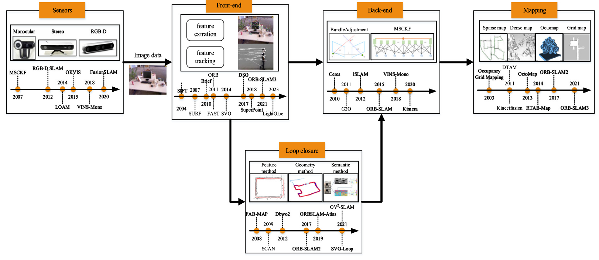
*Figure: SLAM framework - Obtained from [41](#ref-41).*

SLAM begins by acquiring sensor data that the front-end module processes to generate an initial motion estimate. By detecting and matching distinctive features (see [Visual Features](#visual-features)) between consecutive images, the front end computes a real-time estimate of the camera’s trajectory.

The back-end module refines these estimates to ensure global consistency. Bundle adjustment simultaneously optimizes all camera poses and corresponding 3D point positions by minimizing the total error in reprojection images. In graph-based SLAM, poses are represented as nodes connected by edges representing relative transformations, and global optimization adjusts these nodes to minimize overall error [41](#ref-41).

Loop closure detection identifies when the system revisits a previously mapped area, mitigating cumulative errors. It matches visual features and geometric verifications with depth or point-cloud data. Once a loop is detected, new constraints are added to the back end [41](#ref-41).

Then the mapping module builds a coherent environment model. According to [56](#ref-56), ORB-SLAM3 builds a sparse 3D map by triangulating points from selected keyframes and refines it through local bundle adjustment. Mapping is a continuous process, updated in real time—merging new data, correcting drift, and removing outdated elements. ORB-SLAM3 supports map merging, integrating partial maps from different runs, and relocalization—where a place recognition system based on an algorithm called DBoW2 searches for similar keyframes when tracking is lost due to occlusions or abrupt motion, enabling recovery.

As in [35](#ref-35), SLAM pose estimations occasionally fail for brief periods, leading to gaps in visual tracking data and causing the system to miss navigation deadlines. In such cases, optical flow, inertial measurements, and other methods can offer temporary predictions, helping to maintain the navigation system’s functionality for short durations with minimal performance degradation.

#### Scale Invariance

Scale invariance is a property of monocular SLAM. Since these cameras cannot directly measure depth, the scale of the environment is often ambiguous. This can lead to scale drift, where the estimated scale of the environment gradually diverges from the true scale over time. Without an external scale reference—such as stereo vision, LiDAR, GPS scale factors, or known-sized landmarks—monocular SLAM alone cannot support any application requiring absolute distances, heights, or speeds.

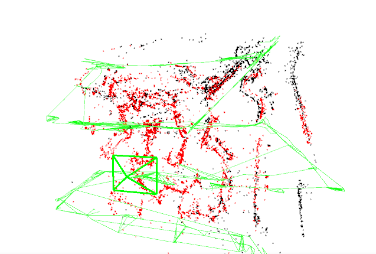
*Figure: A scaleless point cloud. - Obtained from the indoor4 map, see section Section.*

Fixing scale invariance using a monocular camera only is challenging. Another approach is to use relative measurements, such as the motion of features between frames, to maintain consistent scale estimates. Inverse scaling, as in [57](#ref-57), can also model the uncertainty. Additionally, incorporating prior knowledge about the environment, such as known object sizes or geometric constraints, can anchor the scale.

As per [58](#ref-58), IMU readings can indeed resolve scale with VIO. However, the quadcopter’s rapid thrust changes and vibrations yield “spiky” acceleration data, unlike the smooth motion of fixed-wing aircraft, making it harder to achieve reliable scale estimates.

Tasks that only necessitate relative measurements (or a relative map, as in [59](#ref-59)) may not be affected by scale drift, such as autonomous maze exploration based purely on topological connectivity and relative turns, perimeter‐ or wall‐following behaviors driven by optical flow and bearing changes, formation keeping where each UAV maintains a fixed offset in the SLAM map frame, and executing canonical flight patterns—like circular or square laps—specified by relative yaw commands rather than metric setpoints. Following a moving target by keeping it centered in the camera’s field of view and preserving a constant apparent size relies only on relative cues.

Conversely, any task that depends on true metric measurements (absolute scale, as in [58](#ref-58)) becomes infeasible with a purely monocular SLAM map: the UAV cannot reliably hold or change altitude to a specified number of meters (ruling out altitude-constrained inspections, for example), nor can it follow setpoints defined in real-world coordinates since all positions exist only in arbitrary SLAM units. It is also unable to measure or map object dimensions for surveying or inspection, maintain a fixed separation in meters from another vehicle or obstacle, or plan trajectories that guarantee a specific clearance distance separation in meters from another vehicle or obstacle, or plan trajectories that guarantee a specific clearance distance.

### Computational Geometry

Computational geometry interprets raw visual-spatial data into structured representations, which is useful for perception and guidance (see [Guidance](#guidance)). This often involves working with 3D point clouds (see [Mapping](#mapping)).

[60](#ref-60) mentions that efficient manipulation of point clouds relies on geometric algorithms and data structures. Common tasks include outlier filtering, downsampling, surface normal estimation, and segmentation of planar or curved structures. To support real-time performance, spatial indexing structures such as KD-trees or octrees accelerate nearest-neighbor queries, clustering, and region growing. Convex hulls, bounding boxes, and triangulation algorithms are used to extract geometric primitives or build surface meshes. In the UAV context, these tools allow dense map generation, terrain modeling, and safe navigation through cluttered spaces. When combined with semantic labels from machine learning models (see [Mlcv](#mlcv)), geometric features can be interpreted in context—for instance, distinguishing between roads, vegetation, and buildings.

### Machine Learning in Computer Vision

Machine Learning (ML) is a field of artificial intelligence that focuses on developing algorithms and statistical models that enable computers to learn patterns and make decisions or predictions from data without being explicitly programmed for each specific task. Some common tools for machine learning are YOLO v8, a Python library for real-time object detection and tracking, and TensorFlow and PyTorch, open-source frameworks for ML capabilities.

ML enables UAV real-time visual reasoning by transforming raw image feeds into compact, semantically rich representations. Some applications include: in [61](#ref-61), using YOLO v8 for localization of objects in an image; in [62](#ref-62), Deep SORT can maintain consistent identities of objects across images of a video and adjust UAV pose or gimbal angle (camera rotation mount) to keep moving targets centered; In [63](#ref-63), the U-Net tool for neural networks enables pixel-wise semantic segmentation (labeling each pixel in an image with a semantic meaning), and 3D reconstruction or photogrammetry stitches overlapping images into point clouds or textured meshes.

## Mission Management System

The Mission Management System (MMS) is a cyclical decision-making software module. It produces actionable flight commands informed by sensor input. Although terms like “mission planning,” “task execution” and “robot control” overlap in the literature, the term Mission Management System was adopted to encompass all aspects of planning, executing, monitoring, and replanning missions for autonomous UAVs inspired by [64](#ref-64). By combining a task scheduler, a library of modular mission behaviors, and a deliberative planner, the MMS continuously balances competing goals—flight stability, energy efficiency, and sensor coverage—under uncertain conditions. It dynamically responds to emergent events (such as unexpected obstacles or sensor faults) and manages concurrent activities (such as waypoint navigation, target inspection, and communications relay) within a fault-tolerant framework. Its layered architecture—typically implemented via state machines or behavior trees (see [Fsm Bt](#fsm-bt))—cleanly separates decision logic, event handling, and execution, making the system both transparent and extensible for a wide range of UAV scenarios.

Within the autonomy stack of an unmanned aircraft, the software tier that turns mission goals into concrete flight actions is often labeled "mission planner, executive or task–allocation layer." [65](#ref-65) adopts the term Mission-Management System (MMS) and explicitly splits it into a Sequence Control System and a Supervisory Control System that sit above guidance, navigation, and control. Upward, the MMS interfaces with human operators or external planners; downward, it dispatches commands to the flight controller, sensor fusion, and payload managers.

In [16](#ref-16), MMS design follows a three-tier (3T) architecture:

1.  a **reactive layer** that houses tightly coupled movement skills such as *Hover To* or *Fly To*;

2.  a **sequencing layer** that assembles these skills into behavior networks according to a mission script; and

3.  a **deliberative layer** that plans routes, allocates resources, and reasons about goals, constraints, and timing with AI techniques. This third layer is optional.

This separation reconciles real-time responsiveness with long-horizon planning and lets new behaviors be added to the library without redesigning the whole stack. The core decision loop operates continuously in four fundamental functions:

  - **Mission Planning**: subdivides high-level objectives into subtasks, allocates tasks and resources, prioritizes actions, and generates setpoint-based flight plans using high-level path planning.

  - **Flight Execution**: realizes the plan through autopilot-controlled navigation and trajectory tracking, converting setpoints into control commands for the UAV.

  - **Monitoring**: maintains situational awareness by comparing expected versus actual progress, evaluating system health (battery, sensors) and environmental status (new obstacles), and detecting anomalies or failures.

  - **Replanning**: adapts to dynamic changes—re-tasking, reallocating resources, selecting alternate routes or aborting the mission—in response to obstacles, delays, or system faults.

### Finite State Machines and Behavior Trees

[66](#ref-66) contrasts Finite State Machines and Behavior Trees. A Finite State Machine (FSM) structures the MMS software as a directed graph, a common approach. It models the system as a set of discrete operational modes/commands (such as takeoff, cruise, survey, land, return, etc.) and defines transitions triggered by specific events, offering a straightforward framework and predictable behavior. Complex FSMs suffer from state explosion—a large number of states, many sharing identical transitions—and diminished reactivity as the number of modes and possible transitions grows. Each new capability or contingency requires additional states and transition logic, increasing maintenance complexity and introducing latency in decision loops. See Figure [Figure](#fig-fsm) for an example of FSM.

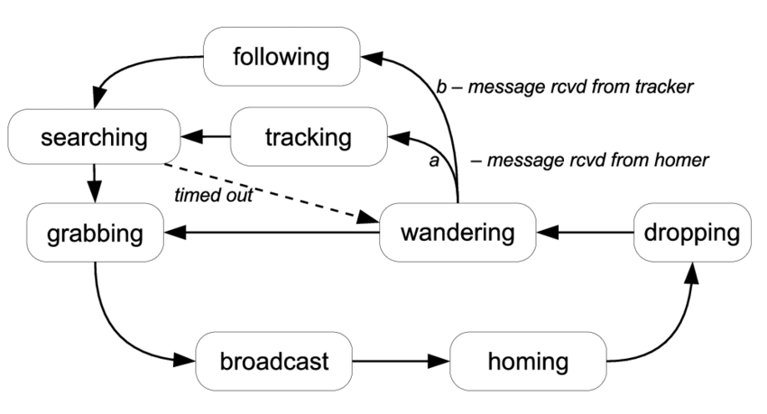
*Figure: Example Finite State Machine - Obtained from [67](#ref-67).*

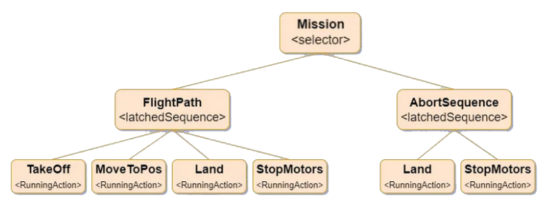
*Figure: Example Behaviour Tree - Obtained from [68](#ref-68).*

In contrast, Behavior Trees structure control logic hierarchically, composing atomic tasks and conditional checks into a tree that returns standardized statuses (Running, Success, or Failure), facilitating rapid task switching and dynamic preemption—allowing, for example, an urgent "Return‐to‐Base" branch to interrupt a lower‐priority "Grid‐Survey" sequence when battery thresholds are crossed. The behavior tree requires a higher upfront investment in its design but improves readability, reusability, and extensibility of behavior definitions.

## Autopilot and Simulation

Simulation is an important aspect of developing and testing UAV systems. Software-In-The-Loop (SITL) is a simulation framework that enables the testing and validation of control algorithms, autonomy, recovery behaviors, flight dynamics, and software architectures in virtual environments without the need for physical hardware. SITL replicates real-world conditions by simulating sensor data, actuator responses, and environmental dynamics.

Various open-source and proprietary SITL solutions exist, but this work employs a toolset consisting of ROS (see [Ros](#ros)), PX4 (see [Px4](#px4)), and Gazebo (see [Gazebo](#gazebo)) for integrated UAV simulation and control. This combination is popular for UAV SITL simulations, found used in [17](#ref-17) or [69](#ref-69).

### Gazebo

Gazebo is an open-source 3D robotics simulator. It is used to model UAV dynamics, sensor behavior, and environmental interactions. It provides a realistic physics engine that simulates aerodynamics and collisions, enabling the validation of control algorithms in diverse virtual scenarios. The Gazebo system is extensible and uses software plugins that add various functionalities.

It supports custom world creation through Simulation Description Format (SDF) files, which employ a modular, hierarchical structure to define every aspect of a simulation environment. At the highest level, an SDF world definition aggregates global physics settings (such as gravity, magnetic field, and real-time update rates), environmental parameters, lighting, and coordinate frames, as well as GUI extensions. System-level plugins for physics solvers, sensor simulators and scene broadcasters can be activated directly within the world file, while terrain and objects are instantiated either by including prebuilt model packages or by defining new models composed of links with collision and visual geometries. This approach allows heightmaps, triangular meshes and primitive shapes to coexist seamlessly, and textures may be projected onto the ground or objects. [70](#ref-70), [71](#ref-71).

### QGroundControl

QGroundControl, from [72](#ref-72), is a ground control station software that serves as the graphical interface for mission planning (such as setpoint editing), real-time telemetry monitoring and display, UAV command execution, and visualizing the UAV’s state, health, and sensor data. It communicates with PX4 (see [Px4](#px4)) through MAVLink (see [Mavlink](#mavlink)) messages. It has buttons for performing survey grids and returning to landing site behavior, and a Parameters dialog where every autopilot setting can be inspected, modified, saved, and restored. The built-in MAVLink Console tab allows advanced users to send CLI commands directly to the autopilot, view logging output, and tune low-level control gains.

### PX4-Autopilot

[73](#ref-73) is an open-source flight control software stack designed for UAVs, responsible for executing real-time low-level control tasks such as attitude stabilization, motor mixing, sensor data fusion, and actuator management. In SITL mode, PX4 emulates the behavior of onboard hardware, processing simulated sensor inputs and generating actuator outputs. Its modular architecture supports a wide range of vehicle types, including fixed-wing, multirotor, and VTOL platforms, and integrates seamlessly with MAVLink for telemetry, command exchange, and GCS communication. It runs on top of the NuttX Real-Time Operating System (see section [Embedded Realtime](#embedded-realtime)).

Moreover, PX4’s internal architecture includes several key modules. An application called `mc_rate_control` implements a high-rate inner loop for angular rate control and motor mixing, ensuring rapid response to disturbances. The `ekf2` module fuses IMU, GPS, magnetometer, barometer, and vision. Finally, the `navigator` module handles mission-level logic—waypoint sequencing, geofence enforcement, and failsafe transitions—by translating flight plans into time-parameterized setpoints that feed back into the control loop.

The PX4 system architecture, presented in the next page’s Figure [Figure](#fig-px4arc) illustrates the integration of multiple concepts in this Theoretical Foundations chapter: communication protocols, hardware interfaces, attitude estimation, guidance, navigation, control, state machines, IMU and GPS drivers, camera and optical flow modules, etc.

Although Figure [Figure](#fig-px4arc) portrays the estimator and controller as blocks, each one executes the explicit equations introduced earlier in this chapter. The six-DOF Newton–Euler model of Section [Frames Dynamics](#frames-dynamics) supplies the plant dynamics for the cascaded PID loops in Figure [Figure](#fig-cascade-control); the attitude loop computes a quaternion error from the desired and measured orientations and scales its vector part by the proportional gain to obtain the body-rate set-point; and the Extended Kalman Filter of Section [Navigation](#navigation) propagates the states and sensor biases with covariance matrices \(Q\) and \(R\). In PX4 these computations live, respectively, in the tasks `mc_rate_control`, `mc_att_control`, `mc_pos_control`, and `ekf2`, whose gains (`MC_ROLL_P`, `MC_VELZ_I`, …), saturations, and noise parameters are exposed as run-time tunables. Hence, the black boxes of Figure [Figure](#fig-px4arc) encapsulate the mathematics of well-defined differential and difference equations that may be inspected, tuned and replaced.

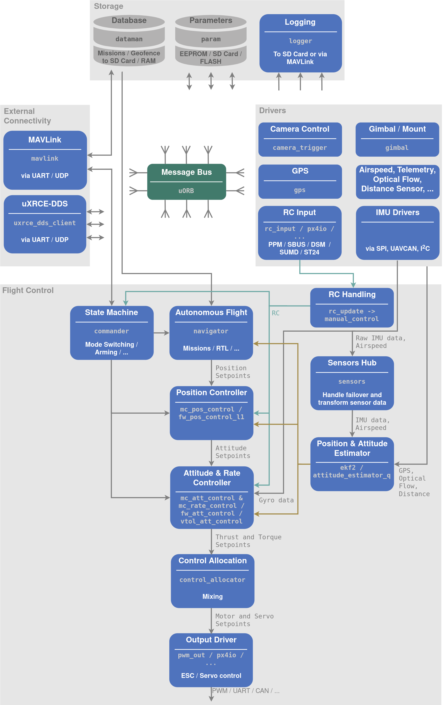
*Figure: PX4 multicopter flight-stack architecture. Grey boxes show major system functions, while blocks represent specific implementations and how each communicates via uORB. The governing equations for each block are detailed in previous sections - Obtained from [74](#ref-74).*

## UAV Communication

UAV communication is structured as a three-tier pipeline reflecting an actual vehicle’s data flow. At its core, PX4’s microsecond-scale uORB (see [Uorb](#uorb)) bus moves IMU samples, estimator outputs, and actuator commands among flight-control modules. Selected uORB topics are bridged into ROS 2 (see [Ros](#ros)) on the companion computer, where DDS middleware forwards camera frames, poses, and mission directives with tunable QoS (see [Communications Concepts](#communications-concepts)). Finally, off-board data is serialized into MAVLink packets (see [Mavlink](#mavlink)) for radio or UDP links, delivering telemetry to QGroundControl and receiving high-level commands. This unified communication chain runs identically in SITL or Raspberry Pi + Pixhawk hardware without changing a single message definition.

### Communications Concepts

Some essential concepts in UAV communication systems are:

  - Communication protocol:  
    Rules for formatting, timing, sequencing, and error-checking messages.

  - Publish/subscribe protocol:  
    Decouples producers and consumers via channels (topics).

  - Packet:  
    A network-layer datagram with its own header and payload.

  - Node:  
    Any endpoint in the messaging system.

  - Serial:  
    Byte-wise transmission over interfaces like UART.

  - Off-board link:  
    A communication path extending off the vehicle.

  - Bus:  
    A shared medium interconnecting modules.

  - Telemetry:  
    Automated collection and forwarding of system data.

  - IP (Internet Protocol):  
    Connectionless addressing and routing of packets.

  - UDP (User Datagram Protocol):  
    Lightweight, unordered, unreliable datagrams over IP.

  - DDS (Data Distribution Service):  
    Real-time pub/sub middleware with configurable QoS.

  - Quality of Service (QoS):  
    Defines parameters—reliability, latency, history, deadlines, durability, and bandwidth—that govern message delivery; these can be tuned (e.g., reliable vs. best-effort, keep-last vs. keep-all, volatile vs. durable) in DDS to balance robustness against resource use.

  - Overhead:  
    The extra processing, memory, or bandwidth consumed beyond the core data payload.

  - Poll:  
    Repeatedly checking a data source for new messages without suspending execution.

  - Block:  
    Waiting (suspending execution) until new data arrives or an event occurs.

  - Broker:  
    An intermediary that routes messages between publishers and subscribers.

  - Discovery:  
    Process by which nodes find each other, often using multicast to announce presence and capabilities.

  - Multicast:  
    One packet delivered simultaneously to multiple recipients.

### Communication Protocols

#### uORB

uORB is PX4’s microsecond-scale publish/subscribe bus, optimized for minimal latency and overhead. Each message is a C struct with a timestamp and payload. Publishers write to buffers in shared memory; subscribers poll or block with a configurable queue. No broker is needed—modules link libuORB and use a simple API. For example, `/vehicle_attitude` streams roll, pitch, yaw, and angular rates at 250 Hz; the topic `/manual_control_d` carries pilot inputs at 50 Hz; and `/battery_status` reports voltage and current at 5 Hz. This design minimizes latency and copy overhead for real-time control, guidance, and monitoring.

#### Simulator Communication

Gazebo (see [Gazebo](#gazebo)) sits at the edge of the autonomy loop, generating a simulated world and injecting sensor outputs via SITL and ROS bridges. At each simulation step, Gazebo plugins generate sensor data—such as IMU, barometer, LiDAR, and camera streams—and transmit them over the SITL UDP interface to PX4, where they are published on uORB topics as if originating from real hardware. Simultaneously, camera plugins publish gz::msgs::Image messages, which are bridged to ROS 2 as sensor\_msgs/Image topics using ros\_gz\_image (or ros\_ign\_bridge). Control data and actuator commands are sent back via MAVLink to Gazebo’s physics engine, closing the loop and ensuring that all data flows through the same communication channels and QoS policies as in real-world operation, enabling end-to-end testing without physical hardware.

#### MAVLink

MAVLink (Micro Air Vehicle Link) is a compact, header-only protocol for real-time telemetry and command exchange between UAV autopilots, companion computers, and ground stations. Each MAVLink packet starts with a one-byte marker, followed by a fixed-length header and a variable-length payload. The header fields are payload length (byte 1), incompatibility flags, compatibility flags, sequence number (for packet-loss detection), system ID, component ID, and a 24-bit message ID. After up to 255 bytes of message-specific data comes a two-byte checksum and an optional signature.

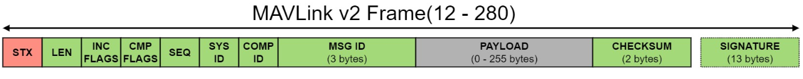
*Figure: A MAVLink v2 Frame - Obtained from [75](#ref-75).*

Common MAVLink messages include HEARTBEAT, which periodically signals system health, mode (hovering, landing, etc.), and uptime; GLOBAL\_POSITION\_INT, broadcasting scaled GPS coordinates (latitude, longitude, altitude) and ground speed (cm/s); and POSITION\_TARGET\_LOCAL\_NED, carrying offboard ds for North–East–Down position, velocity, acceleration, and yaw. New messages are added by extending the XML dialect with unique IDs, and endpoints negotiate supported features via the incompatibility flags in the header.

#### ROS

The Robot Operating System (ROS) is a decentralized, peer-to-peer robotics middleware comprising user-space libraries, build tools (colcon/Ament), and conventions—not a kernel module or central daemon [76](#ref-76). Each invocation of `ros2 run`, a launch file, or a systemd-supervised unit spawns one or more node processes. Inside each node, the ROS-Middleware (RMW) plugin (e.g., MAVROS, Fast DDS, Cyclone DDS, or micro-XRCE-DDS) discovers peers via multicast, advertises topics, types, and per-topic QoS policies, and then serializes and routes messages directly over UDP, shared memory, or RTPS–TCP. A simple `publish(msg)` call maps to a DDS DataWriter write(), delivering data to all matching DataReaders without any broker or `roscore`—the only OS processes are node binaries.

This fully decentralized design scales from microcontrollers to containerized UAVs. DDS provides fine-grained QoS controls so developers can, for example, run a 30 Hz camera feed on best-effort while keeping setpoint commands reliable and persistent. Proper QoS tuning prevents latency spikes and bounds bandwidth—vital when MAVLink telemetry shares a low-power radio link. ROS 1 and ROS 2 interoperate via bridge nodes; MAVROS translates between MAVLink and ROS topics to connect flight controllers and companion computers; micro-XRCE-DDS brings DDS pub/sub to resource-constrained hardware; and `ros_gz_image` (or `ros_ign_bridge`) publishes Gazebo’s `gz::msgs::Image` as `sensor_msgs/Image`.

## Embedded UAV Systems and Real-Time Execution

Ensuring UAV autonomy requires that software tasks meet strict timing guarantees. These tasks fall into two categories: hard real-time and soft real-time. Hard real-time tasks are those whose deadlines are safety-critical—if they miss a deadline, the UAV can lose stability or even crash. Inner-loop attitude controllers and motor-mixing algorithms fall into this category, running hundreds of hertz to maintain smooth, stable flight. Soft real-time tasks can afford the occasional missed deadline without immediate failure, though performance may degrade. Examples include state estimation (EKF updates), SLAM front-ends, telemetry logging, and high-level mission planning, which typically execute anywhere from tens to hundreds of hertz. These processes improve system functionality but are not directly responsible for flight safety.

| **Task**                                        | **Frequency (Hz)** |
| :---------------------------------------------- | :----------------: |
| Inner-loop controllers (attitude stabilization) |     250 – 400      |
| State estimators (EKF)                          |     100 – 250      |
| SLAM feature tracking                           |      10 – 30       |
| High-level planners & mission modules           |      10 – 50       |
| Telemetry & logging                             |       5 – 20       |

Typical Scheduling Frequencies for Key UAV Tasks

An operating system is the foundational software layer that arbitrates access to hardware resources—the Central Processing Unit (CPU), memory, storage, and peripherals—and exposes a uniform interface for all applications. At its core resides the kernel, a privileged component responsible for scheduling tasks, enforcing memory protection, and handling interrupts. Device drivers, integrated into or alongside the kernel, translate generic service requests (“read from GPS”) into the precise signals required by hardware. User-space applications run with restricted privileges and invoke kernel services via system calls.

As mentioned by [77](#ref-77), at the lowest level of the embedded system sit drivers and hardware abstractions such as I²C, SPI, UART, PWM, DMA, and ISRs: I²C is a two-wire bus for low-speed peripherals; SPI is a high-speed four-wire master–slave link; UART is an asynchronous serial port framed by start/stop bits; PWM varies a digital output’s duty cycle to encode analog values; DMA moves data between memory and devices without CPU load; and ISRs are immediate, kernel-invoked routines that handle hardware events.

As in the review from [78](#ref-78), a Real-Time Operating System (RTOS) such as NuttX—used by PX4 (see [Px4](#px4)) and which is not a variant of Linux but an independent POSIX-compliant microkernel—provides hard real-time guarantees via a preemptive, priority-based scheduler and low-latency interrupt handling so that control loops run at precisely fixed rates, while a standard Linux kernel patched with PREEMPT-RT [79](#ref-79) delivers soft real-time behavior by allowing high-priority threads to preempt lower-priority tasks and reducing scheduling jitter, enabling reliable execution of perception and planning processes alongside PX4’s hard real-time tasks. Autonomous UAV operation relies on tightly synchronized control. PX4 enforces timing constraints by running its control algorithms and sensor fusion filters. Due to its bounded response times and preemptive scheduler, it ensures IMU readings are processed and motor commands issued without missed deadlines or priority inversion, which is essential for stable and responsive flight.

### Temporal Constraints in UAV Decision‐Making

A UAV’s system design must balance the desire for extensive data processing with the need for timely control updates. The time required for each computation cycle of the odometry system must be sufficiently low to keep pace with the UAV’s motion and environmental changes. Various factors can influence the time taken to make a decision, among them:

  - Refresh frequency: the rate at which sensors or software programs provide new data. A typical IMU sensor, for example, delivers a data rate on the order of one hundred Hz [80](#ref-80), and a camera at 30 frames per second. Faster updates allow the UAV to react quickly to unexpected events, such as wind gusts or the sudden appearance of obstacles. However, high-frame-rate inertial measurements may need to be downsampled or synchronized with lower-frame-rate visual streams to ensure consistency in data fusion [35](#ref-35).

  - Data Processing Latency: the computational delays introduced during data processing tasks such as filtering, feature extraction, and sensor fusion. High-latency processing can cause outdated information to influence decisions [38](#ref-38).

  - Network Communication Delays: such as bandwidth limitations, packet loss, and transmission delays. Data may come from remote sources such as GCS or cloud servers [19](#ref-19).

  - Synchronization Overhead: time taken to integrate data from multiple heterogeneous sensors. Particularly relevant when data arrives asynchronously [21](#ref-21).

  - Algorithm Complexity: More complex algorithms may offer higher accuracy but require more processing time [21](#ref-21).

  - Hardware Limitations (see [Deploy](#deploy)): the processing capabilities of onboard hardware, such as CPU speed, GPU availability, and memory bandwidth [18](#ref-18).

  - Decision Uncertainty: to ensure decisions are made with a certain level of confidence, the system may wait until sufficient data has been gathered [19](#ref-19).

## Docker and Portability

Building a reliable UAV autonomy pipeline demands managing complex software dependencies. [81](#ref-81) containerization helps by packaging the entire software stack into an isolated, reproducible environment. Docker can create a container in which two machines—regardless of their underlying operating systems or installed libraries—execute identical low-level drivers, middleware, and application code. By encapsulating every dependency, configuration file, and environment variable, Docker eliminates version mismatches and dependency difficulties, guaranteeing that a containerized UAV simulation and control system behaves identically across development, testing, and deployment platforms. This reproducibility not only accelerates onboarding and collaboration but also provides a stable foundation for DevOps continuous integration and automated testing [82](#ref-82).

As in [83](#ref-83), Docker can open Graphical User Interface (GUI) windows, as a program native to the operating system may. Docker’s network and port-mapping features recreate the same UDP and TCP endpoints used inside a container, guaranteeing that interprocess communication within the container interoperates with the outside (host) environment—thus delivering a fully isolated yet functionally identical development and testing environment.

Docker images consist of layered, read-only filesystems defined in a Dockerfile; at runtime, containers mount a writable overlay atop these layers. To preserve critical data—such as log files and configuration scripts—Docker provides volumes, which map host directories into the container’s filesystem. Volumes decouple persistent artifacts from the ephemeral container state, ensuring that simulation outputs survive container recreation or updates [82](#ref-82).

For compute‐intensive vision and SLAM workloads, hardware acceleration—the use of the Graphical Processing Unit (GPU) at near-native speed—can be achieved via GPU passthrough. Enabled, for example, by the NVIDIA Container Toolkit, GPU passthrough binds the host’s GPU device files (e.g., /dev/nvidia\*) and their drivers into the container namespace, granting direct access to the physical GPU for accelerated image processing and mapping [82](#ref-82).

## Hardware Considerations

Transitioning from simulation to real-world deployment introduces a number of hardware and communication challenges.

### Flight‐Control Firmware Portability

PX4’s autopilot code is written for ARM Cortex-M microcontrollers and must be cross-compiled using an `arm-none-eabi-gcc` toolchain. The PX4 Hardware Abstraction Layer (HAL) decouples low-level drivers (I²C, SPI, UAVCAN, PWM, UART) from higher-level control logic so that the same firmware binary can run unmodified on different flight controller boards. Companion‐computer code (e.g., on NVIDIA Jetson or Raspberry Pi) is typically compiled for Linux/x86\_64 or Linux/ARM, and relies only on hardware-agnostic APIs (POSIX threads, DDS middleware, CUDA via Docker) to maximize portability.

### Energy and Thermal Management

Embedded platforms must manage power draw and heat dissipation under sustained computational load, essential to avoid runtime slowdowns or unexpected shutdowns. Workload balancing can help maintain performance by offloading non-critical tasks to a ground station.

### Hardware‐In‐The‐Loop (HITL) Simulation

Before deploying on a physical UAV, Hardware‐In‐The‐Loop integrates real flight controllers or sensors with the Gazebo‐PX4 SITL environment. In HITL, the flight controller runs genuine firmware on its RTOS while Gazebo provides synthetic sensor data and physics, closing the loop via MAVLink or uORB bridges. This setup validates hardware–software interfaces under controlled conditions, exposing timing issues, driver bugs, or sensor calibration errors that might not appear in pure software‐in‐the‐loop tests.

### Real‐Time Execution and Communication

Onboard flight control requires hard real-time guarantees for attitude stabilization and motor mixing, provided by NuttX on the autopilot. Soft real-time tasks (SLAM, mission management) run on the companion computer under Linux. In physical operations, wireless links (e.g., 900 MHz telemetry radios) introduce unpredictable delays and packet loss, so critical commands must be redundant and time-stamped.

### Docker

The Docker container guarantees that development, testing, and ground station environments share identical dependencies and configurations. During real-world deployment, the same container image can run on an embedded Linux host, simplifying field updates and rollbacks.

### Operational and Safety Considerations

Hardware–software mismatches (e.g., PX4 firmware version vs. flight controller bootloader) may require re-flashing or using alternative middleware (Micro XRCE-DDS vs. MAVROS). An operations manual detailing pre-flight checks—battery voltage, GPS lock, sensor calibration, and radio link tests—and a supply of spare components (propellers, batteries, and motors) are essential to reduce mission risk. Environmental factors such as electromagnetic interference, multipath GPS errors and dynamic obstacles cannot be fully captured in simulation and demand fault detection and contingency planning in the Mission Management System.

# Materials and Methods

## Bibliographic Search

To evaluate solutions and outcomes for the implementations of multicopter UAV simulation using SLAM navigation, a bibliographic search was conducted using the academic databases CAPES and Google Scholar.

The following search terms were developed:

| **Search Terms**                                                                  |
| :-------------------------------------------------------------------------------- |
| navigation SLAM UAV                                                               |
| gazebo SLAM navigation                                                            |
| SLAM implementation UAV                                                           |
| navigation SLAM UAV AND (simulation OR platform OR framework) AND (gazebo OR px4) |
| VIO SLAM UAV                                                                      |
| UAV navigation (GPS OR GPS)                                                       |

Approximately 200 academic sources were analyzed. A majority has been filtered out following the criteria below:

| **Selection Criteria**                                                                          |
| :---------------------------------------------------------------------------------------------- |
| The study must involve a practical implementation, not just theoretical analysis.               |
| The source code must be publicly accessible on platforms such as GitHub, Bitbucket, or GitLab.  |
| The study must implement a real-time 3D SLAM solution.                                          |
| The approach must utilize the Gazebo simulator and the PX4 Autopilot.                           |
| The method must be convertible into a monocular SLAM solution.                                  |
| The approach must not rely on LiDAR and should be adaptable to a non-LiDAR solution.            |
| The solution must be applicable to GPS-denied environments, not just GPS-starved conditions.    |
| The approach may be a pure visual odometry solution, but visual-inertial odometry is preferred. |

Existing open-source codebases were also explored and leveraged. Specialized code search engines, such as [84](#ref-84) and [85](#ref-85), are useful for finding code patterns similar to those in known implementations. For example, search queries like ’/fmu/in/vehicle\_command’ or ’Trajectoryd()’ return several Python code examples for sending control commands to UAVs.

## Related Works

### XTDrone

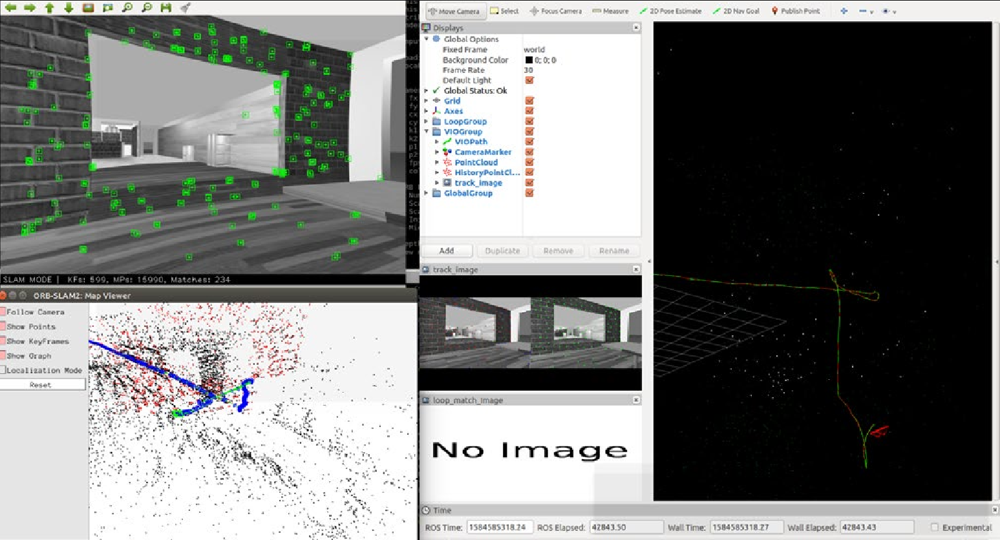
*Figure: XTDrone simulation using ORB-SLAM2 - Obtained from [17](#ref-17).*

In [17](#ref-17), the authors present XTDrone: a highly extensible multi-rotor UAV simulation platform designed to tackle the broader challenges of UAV simulation. The authors highlight that "it is hard to realize multi-rotor UAV simulation in existing flight simulators." In a later study [20](#ref-20), it further asserts that "few platforms are open source and user-friendly." The XTDrone simulation platform was developed in response to this situation. The system integrates essential robotics and flight control technologies, including ROS, Gazebo, MAVLink, MAVROS, and PX4, all within a Dockerized environment that simplifies deployment. Additionally, it is optimized for NVIDIA GPUs and leverages the Python Rospy library, enhancing usability and facilitating rapid development. XTDrone also supports various SLAM extensions, including ORB-SLAM2, ORB-SLAM3, RTAB-Map, and VINS-Fusion, allowing for flexible configurations using monocular, binocular, depth, or multi-sensor fusion approaches. While it provides documentation for setting up these SLAM systems, some manual configuration is required. The work also presents SLAM accuracy evaluations using standard metrics such as Relative Pose Error (RPE) and Absolute Pose Error (APE). The platform appears to be reasonably maintained, with its last recorded update in May 2024. XTDrone does not include perception-based tasks such as creating an occupancy grid map, semantic SLAM, or point cloud manipulation. Included with the simulation software, there are a small number of mission scenarios from real UAV competitions, but those are poorly documented. While XTDrone is a strong candidate for evaluation, it has not yet been tested, and its performance and ease of integration remain unassessed. However, it holds significant potential for future work and could play a crucial role in advancing UAV simulation research.

### E2ES

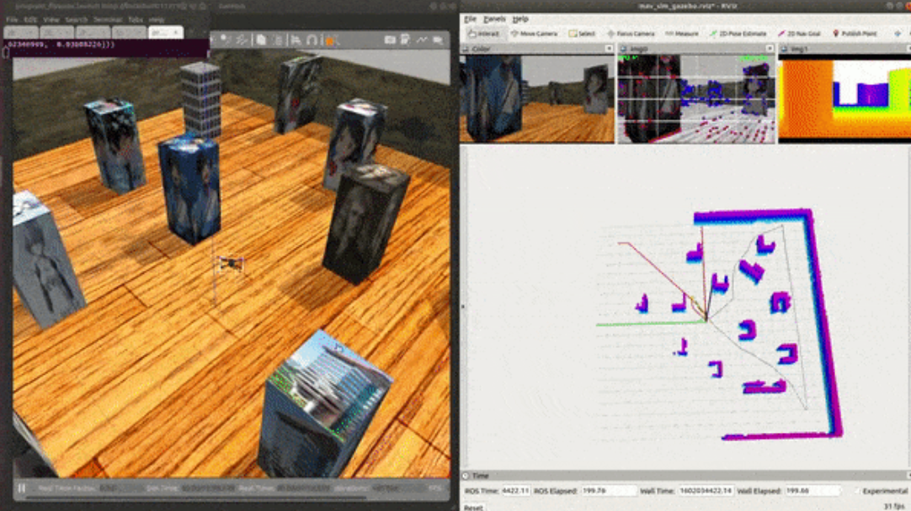
*Figure: End-to-End Simulator (E2ES) - Obtained from [69](#ref-69).*

In [69](#ref-69), the authors present an end-to-end simulation framework for UAVs incorporating SLAM and navigation applications, designed for research and educational purposes. The paper highlights that "some simulation tools achieve autonomous navigation to a certain degree, but their flexibility is limited, and their source codes have not been released," underscoring the need for an accessible open-source simulation. The proposed solution integrates widely used technologies, including PX4, ROS, Gazebo, and MAVROS, and is distributed as a Docker container with all necessary tools pre-installed. The implementation is highly customized. The same authors, in [80](#ref-80), have developed an open-source library called FLVIS (Feedback Loop Based Visual Inertial SLAM) for within E2ES. However, indications suggest that the library is no longer actively maintained and has not seen widespread adoption in other implementations. Furthermore, the system appears to be compatible exclusively with the Intel RealSense D435i camera in depth and stereo modes, lacking support for monocular SLAM. The documentation provides limited guidance on effectively utilizing the framework, and the internal structure is complex, distributed across multiple repositories, and not user-friendly. In conclusion, while the implementation presents a functional simulation environment, it has significant areas for improvement and could serve as a foundation for developing a more accessible and practical UAV SLAM simulator, better aligned with its educational objectives.

### RTAB-Map UAV Simulation

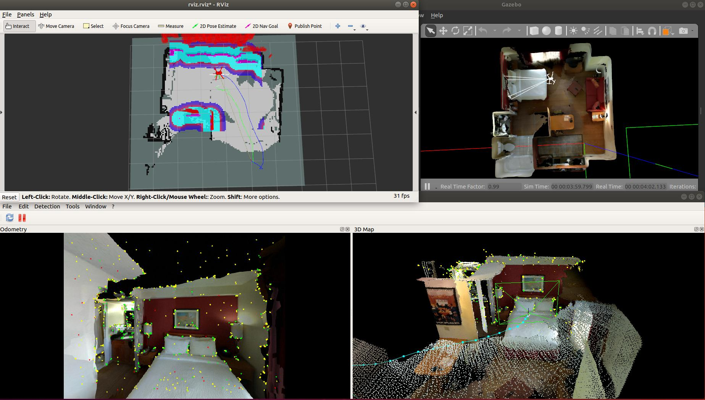
*Figure: RTAB-Map UAV simulation - Obtained from [86](#ref-86).*

In the GitHub repository from [86](#ref-86), an open-source simulation for UAVs with SLAM is presented, developed by the author of the RTAB-Map SLAM library, [21](#ref-21). It uses PX4, ROS, MAVROS, and Gazebo in a dockerized environment, significantly reducing configuration and setup efforts. It requires NVIDIA GPU hardware and proper drivers installed with Docker runtime to function. The implementation employs an Intel RealSense R200 RGB-D stereo camera, which features two infrared cameras for depth estimation alongside an RGB camera. It remains uncertain whether the system can be adapted to a monocular SLAM configuration. The simulation uses 2D navigation, meaning potential modifications may be required for full 3D SLAM capabilities. Despite this limitation, the project is well-documented, with clear instructions and a structured organization. Additionally, the repository has received recent bug fixes, indicating continued maintenance and stability. It includes C++ offboard control code for UAV operation, it is unclear whether it can be adapted for using an existing Python UAV control implementation. Further questions remain regarding the support for wider and less feature-rich maps and its ability to operate with different UAV models or cameras. The Gazebo and PX4 versions used in the implementation are somewhat outdated. This project remains a strong starting point for the UAV SLAM simulation.

In [18](#ref-18), a monocular visual autonomous landing system is presented for quadcopter UAVs, implemented in a Gazebo-based simulation and tested on an F450 quadcopter with an Odroid XU4 embedded processor. While the study mentions ORB-SLAM2 for localization, it emphasizes the high demands in real-time performance, arguing that "these techniques are prone to deliver low spatial resolution and be computationally expensive, hindering the performance of autonomous landing applications." To mitigate these limitations, the authors propose an image-based method that performs control calculations in 2D image space, eliminating the need for computationally intensive 3D position reconstruction and enabling real-time operation on low-cost embedded hardware. This work is a valuable reference for insights into perception-based mission scenarios, for evaluating SLAM-aided landing capabilities, and for identifying performance constraints in onboard SLAM UAV deployments.

# Development

## Environment Overview

GamaFlyware is an end-to-end development environment for multicopter UAV SITL simulation, designed to facilitate the development and testing of UAV systems and MMS in a controlled and reproducible manner. It leverages computer vision features and SLAM and includes 44 simulator maps.

The system is released as open-source software designed to support academic research leveraging existing libraries, with all software released under the permissive MIT license, except for the ORB-SLAM3 portion and QGroundControl, which is under GNU GPL v3. Users are free to inspect, modify, and redistribute the software in accordance with the license terms.

GamaFlyware uses a containerized architecture built on Docker to ensure a consistent and reproducible development setup. All dependencies, configurations, and software versions are encapsulated, guaranteeing identical behavior across machines. This eliminates the complexities of managing software stacks, simplifies onboarding—users can pull and run the image without manual setup—and enables safe experimentation through easy rollbacks. This setup functionally provides an operating system with necessary software for simulation already included.

Users interact through Visual Studio Code’s Dev Container integration, which offers pre-configured terminals, code completion, and debugging tools. The container includes support for popular extensions like C/C++, Python, terminal managers, formatters, and ROS visualization tools for a development experience within the IDE.

A GitHub repository was created for version control of code inside the container, documentation, and to host the Docker Compose file necessary for running the environment. Using Git for this environment is optional but recommended.

The PX4-Autopilot and Gazebo stack can be accessed via ROS 2 message bridges. Components such as perception nodes, mission logic, and control pipelines are developed in a hardware-agnostic manner, allowing them to be deployed directly to embedded platforms like a Raspberry Pi with a Pixhawk flight controller. This approach allows development and testing on a laptop from Software-In-The-Loop simulation to real-world UAV deployment with minimal reconfiguration, as the same binaries used for development and testing on a laptop can be run on actual hardware by simply replacing the Gazebo simulator with the physical UAV.

The system is primarily intended for Ubuntu Linux hosts, as GPU passthrough and container networking are best supported in this environment. Using the system may require NVIDIA GPU hardware and proper drivers installed with Docker runtime to function with the expected performance. Regardless, GPU functionality may be disabled, at a higher processing cost for the CPU.

GamaFlyware is contained within a single Docker image that consumes approximately 40 GB on the system and 14 GB to download due to the inclusion of all dependencies, pre-built binaries, and GPU libraries. This ensures that users do not need to manually build or configure any component, which is a significant undertaking, but it does require disk space and a stable internet connection for the initial download.

For real-time operation of the most demanding scenes, it is recommended to have at least an NVIDIA GeForce RTX 2050, 4 GB VRAM, 32 GB RAM, a powerful CPU, and a fast SSD with 70 GB of free disk space. On less capable hardware, the simulator remains still usable, albeit slower. The system was built in a Lenovo LOQ laptop with an Intel Core i5-12450H processor.

Without SLAM, it consumes 25% on all CPUs, 40 tasks, 200 threads, and 3GB of memory at startup, but gradually grows. The SLAM elevates all CPU loads to 65% usage and takes up 1 GB of additional RAM consumption.

Furthermore, the MMS system supports detailed logging and debugging capabilities, searches and monitoring decisions live, and the UAV makes and troubleshoots issues effectively. A plotting module may be attached to the system for enhanced data visualization. QGroundControl GCS software integration enables telemetry visualization, giving manual commands, and PX4 debugging.

## High-Level System Architecture

### Filesystem

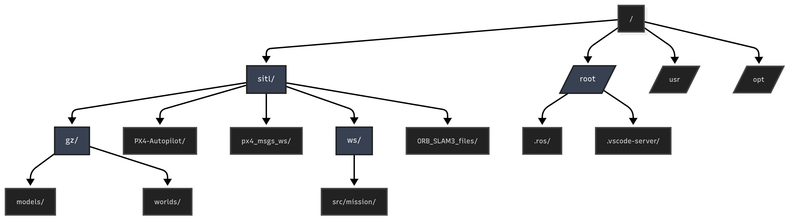
*Figure: Filesystem structure of GamaFlyware Docker container.*

The `/sitl` directory (12 GB) is the main workspace, containing all user projects and simulation tools. It includes `gz/` with Gazebo assets—`models/` (2000 meshes) and `worlds/` (44 curated `.sdf` scenes); `PX4-Autopilot/` with the tagged PX4 firmware (2.7 GB); `ws/`, the main MMS Colcon workspace in `src/mission/`; another Colcon workspace for bridging PX4 and ROS 2 in `px4_msgs_ws/`; and `ORB_SLAM3_files/` (5.0 GB) with vendored Eigen, Pangolin, and ORB-SLAM3 libraries. The `/root` directory (15 GB) hosts runtime data, including `.ros/` (1.7 GB logs), `.vscode-server/` (3.5 GB), `.cache/` (7.2 GB), and `mavros_ws/` (1.3 GB).

### System Architecture

GamaFlyware’s architecture builds off from the model PX4-Autopilot uses—a vertically integrated solution. The system is open to extensions, with strict separation of responsibilities for each module. With some effort, each component may be replaced by an equivalent: Gazebo by the real aircraft environment. Simulated PX4 for actual PIXHAWK or for ArduPilot. PX4 can be upgraded simply by rebuilding its container mount; all binaries, third-party libraries, and simulation assets are baked into the image. The following schematic distills this architecture into a concise overview.

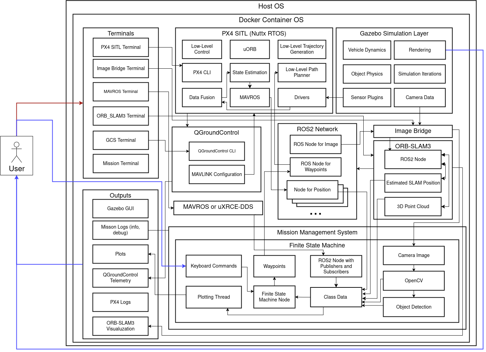
*Figure: A partial system architecture diagram for GamaFlyware.*

Terminals and outputs group the human-facing I/O. Terminals include MAVROS, ORB-SLAM3, QGroundControl, plotting, and mission control. Note Gazebo and QGroundControl have GUIs, but QGroundControl as well as PX4 also expose CLIs. The user, therefore, can observe the entire autonomy stack from multiple perspectives up to high-level mission states in real time and can inject new inputs or inspect failures.

Launching GamaFlyware requires starting six services in separate terminals. The whole stack does not run if PX4-Autopilot is not running. Gazebo begins streaming simulated sensor data, PX4’s SITL instance initializes and broadcasts its heartbeat, the ROS2–PX4 bridge (MAVROS) remaps those topics into the ROS 2 ecosystem, the image-bridge node makes camera frames available to perception modules, ORB-SLAM3 starts its localization pipeline, and finally the QGroundControl viewer connects to display live telemetry and accept user commands.

When modifications are made to any of the ROS 2 packages, the workspace needs rebuilding. Visual Studio Code’s Dev Container integration is configured to launch each service in its own integrated terminal. The linux window manager X11 must be forwarded for Docker so that all graphical interfaces appear on the host desktop, discussed further in Section [Container](#container).

### Communications

GamaFlyware uses a combination of message buses for inter-component communication: MAVLink is the primary protocol for exchanging messages between the GCS, and the MAVROS ROS 2 node handles MMS communication. PX4’s uORB bus serves as the real-time message-passing layer within the autopilot. The ORB-SLAM3 module receives and sends information via ROS 2. Gazebo’s SITL GZBridge plugin publishes synthetic messages such as IMU, GPS, and camera data; PX4 decodes them as if from real hardware and publishes each sensor stream on its microsecond-scale uORB bus. The message passing between the components is demonstrated in Figure [Figure](#fig-position-msg).

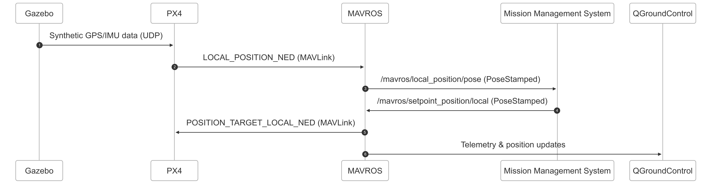
*Figure: A sequence diagram depicting position data message passing.*

The underlying network mechanism for communication is the UDP protocol and Linux OS interprocess communication features. Network communication between system components is established via UDP and TCP ports, such as PX4 communicating with MAVLink on UDP port 14445, QGroundControl connecting to PX4 on UDP port 14570, MMS interacting with PX4 on UDP ports 14580 and 14540, and PX4 interfacing with Gazebo over TCP port 4560.

Table [Table](#tab-ros2-topics) shows ROS 2 topics used by the components to control the UAV, pass images around, and exchange position data. The MMS node subscribes to these topics to make decisions based on the received data and publishes control commands to the UAV.

| **Topic**                     | **Direction** | **Msg type**                 |
| :---------------------------- | :------------ | :--------------------------- |
| `camera`                      | Subscription  | `sensor_msgs/Image`          |
| `/mavros/gpsstatus/gps1/raw`  | Subscription  | `mavros_msgs/GPSRAW`         |
| `/orbslam3/pose`              | Subscription  | `geometry_msgs/PoseStamped`  |
| `/mavros/local_position/pose` | Subscription  | `geometry_msgs/PoseStamped`  |
| `/mavros/state`               | Subscription  | `mavros_msgs/State`          |
| `/mavros/d_position/local`    | Publisher     | `geometry_msgs/PoseStamped`  |
| `/mavros/d_raw/local`         | Publisher     | `mavros_msgs/PositionTarget` |

ROS2 topics used

  - sensor\_msgs/Image:  
    Image frame with timestamp.

  - mavros\_msgs/GPSRAW:  
    GPS satellite triangulation data.

  - geometry\_msgs/PoseStamped:  
    Timestamped 3D pose (position + orientation).

  - mavros\_msgs/State:  
    Flight controller status (armed, mode, link).

  - mavros\_msgs/PositionTarget:  
    Setpoints are represented as position, velocity, acceleration, and yaw.

MMS overwrites PX4 with a forced MAVLink, injecting custom estimates from the SLAM subsystem at will. The original message from PX4, thus suppressed, comes from the optical flow module PX4 by default. Named VISION\_POSITION\_ESTIMATE, it contains a timestamp in microseconds, the x, y, and z positions in meters, and the roll, pitch, and yaw angles in radians.

Simultaneously, the camera‐specific bridge ros\_gz\_image listens to Gazebo’s message called gz::msgs::Image and republishes to ROS 2 sensor\_msgs/Image, to be read by MMS perception and SLAM nodes. Control and actuator commands generated in PX4 or in ROS 2 are sent back over MAVLink via MAVROS. Telemetry and high-level commands to QGroundControl share the same MAVLink link. A sequence diagram of the camera input to motor control command is shown in Figure [Figure](#fig-image-decision6).

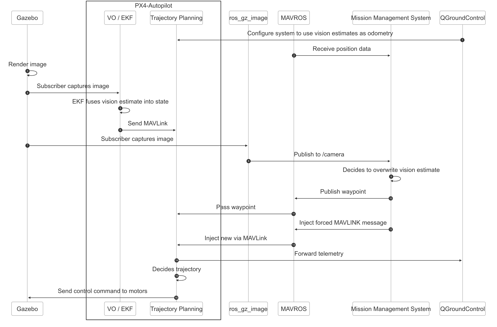
*Figure: A sequence diagram depicting camera input to motor control command.*

## System Components

### Container

The container itself is built from the Linux Ubuntu 22.04 image, with its working directory set to /sitl. It’s given a 30 GB RAM limit and 12 CPU cores and exposes the host’s NVIDIA GPUs via the Docker device reservation API so that any CUDA-enabled code inside can see all GPUs. The container mounts the X11 socket and propagates the host’s DISPLAY, HOST\_USERNAME and NVIDIA environment variables to support GUI and GPU workloads. It launches as the unprivileged user qgcuser—created on startup—so the filesystem under /sitl is owned by that user, and then sleeps indefinitely for interactive sessions.

In the initial stages of building the container, the Dockerfile installed essential build tools and then cloned and compiled the PX4-Autopilot SITL targets. It also installed the Gazebo-ROS bridge. In the user’s workspace, there are dependencies px4\_msgs and px4\_ros\_com at PX4’s v1.14 release, built with Colcon. These dependencies are required to build the MMS ROS workspace, being used to bridge PX4’s uORB messages into ROS 2 topics. They demand significant time to compile, and therefore, for convenience, the container includes pre-built binaries of these dependencies.

There are approximately 2500 dependencies. For Python, it includes ROS 2 packages, related robotics/simulation libraries, and core data science vision stacks. Additionally, several Ubuntu/Debian packages, such as the C/C++ libraries for robotics and simulation, the build toolchain, GUI and multimedia stacks, and GPU/parallel compute dependencies.

The container may be extended with additional software, code, or configuration. A Docker commit may convert the entire container state into an image that could be uploaded to Docker Hub, saving the entire system state to prevent breaking changes, and every asset present within it would be packed within the image itself. The container codebase is a Git repository, to be used for version control in remote repository hosting platforms.

### Simulator and Autopilot

All simulator and autopilot runs are entirely on default settings. Sources reside in the `/sitl/PX4-Container` directory, with Gazebo (Harmonic 8.7.0), ROS 2 (Hawksbill), and PX4-Autopilot (release/1.15) locked to specific compatible versions. During operation, PX4 and Gazebo emit extensive telemetry and log files within the `PX4-Autopilot/log` folder. For systematic debugging and performance evaluation, the environment can be configured to record ROS 2 bag files, capturing every published message with precise timestamps. These bags enable offline playback without re-running the simulation.

### The Mission Management System

The Mission Management System is located in the folder /sitl/ws/src/mission as a ROS 2 Python Colcon package, split up as several Python files. The folder also hosts various mission scenarios and core classes.

#### MMS Design

The MMS is designed as a modular system, with clear separation of concerns and well-defined interfaces. The modular design ensures that common functions such as state transitions, command handling, and sensor integration remain consistent while still allowing for custom behavior tailored to the mission at hand. Its communications have been described in section [Uav Communications](#uav-communications). A class diagram can be found in Figure [Figure](#fig-mmsarc). Mission orchestration is discussed in section [Missionorchestration](#missionorchestration).

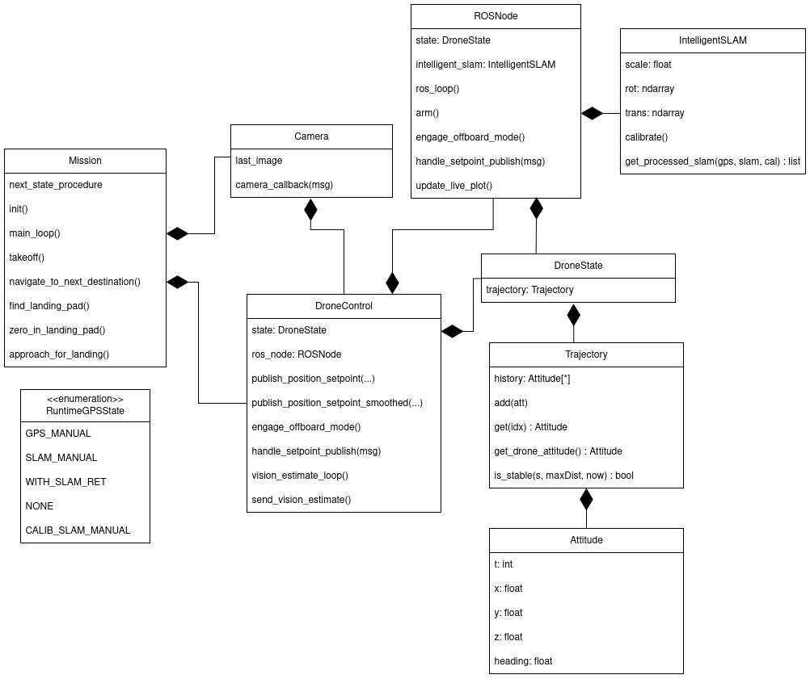
*Figure: Class diagram of the modular MMS architecture.*

The MMS is bootstrapped by a single Python script that first configures a clean shutdown and logging before spinning up the core components. A shared exit event can tear a system down gracefully without leaving running processes. Logging is centralized with info and debug log streams, tapping into key function calls. At startup, it initializes rclpy, constructs a shared DroneState, and then injects that state into a ROSNode (the low-level comms layer), a DroneControl (the offboard command interface), a camera adapter, and finally a mission instance (the scenario FSM).

Inside ROSNode, two timers drive the real-time loops: a 100 Hz thread for PX4 heartbeats and setpoint pooling MAVLink vision estimates, and a 10 Hz plotting thread that optionally sends buffered trajectory and diagnostic data into a forked Matplotlib plotting process. Concurrently, DroneControl launches its own daemon thread for vision estimates, which continuously fuses GPS and SLAM data to decide whether PX4 MAVLink messages should be using raw GPS, calibrated SLAM, or a blended estimate. An optional key capture thread listens for keyboard commands to override fusion modes or tweak lat/lon offsets.

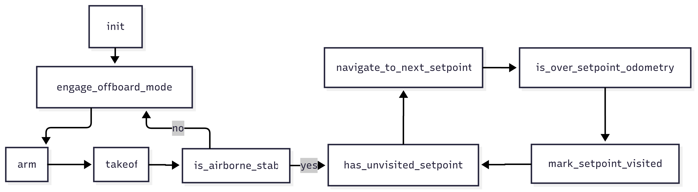
*Figure: Implemented Finite State Machine for the setpoint navigation.*

#### MMS Features

##### Finite‐state mission controller

Mission orchestration is entirely factored into the Mission class, which holds a pointer to ROSNode, Camera, DroneState and DroneControl and defines its workflow as a concise finite‐state machine. Each state is a single method (init, arm, takeoff, navigate, detect, land, etc.), and transitions are declared in a simple dictionary mapping “next,” “yes”/“no” or boolean‐based edges. Adding a new profile only requires subclassing or overriding a handful of these handlers—no changes to the engine, comms, or plotting layers—so that fetch-and-deliver, perimeter patrol, or QR-code landing missions all slot into the same minimal interface.

In section [Perceptive Landing](#perceptive-landing), a landing system is presented as a result. The finite state machine for the landing system is shown in Figure [Figure](#fig-landingfsm). It is a simple FSM that uses the PX4 offboard mode to control the UAV and uses the camera to detect the landing pad.

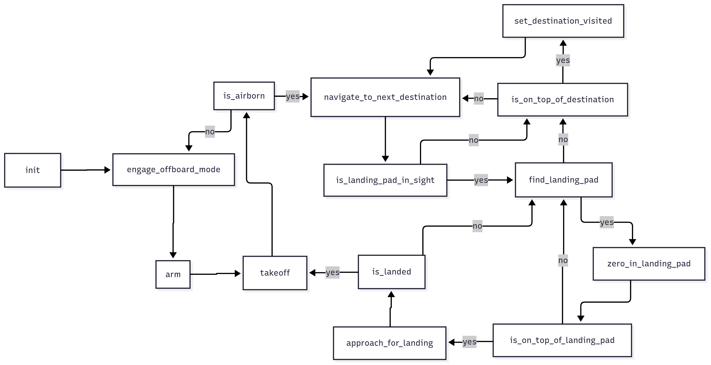
*Figure: Finite State Machine for the landing scenario (see Section).*

To further demonstrate the capabilities of the MMS, a custom mission scenario was developed for the [12](#ref-12) UAV challenge that required detecting and reading QR codes on the ground while hovering. Upon successful detection, it would approach and capture the package with the QR code on it solely using visual feedback. The code for this sample is not provided, but the FSM is shown in Figure [Figure](#fig-fsmqrcode).

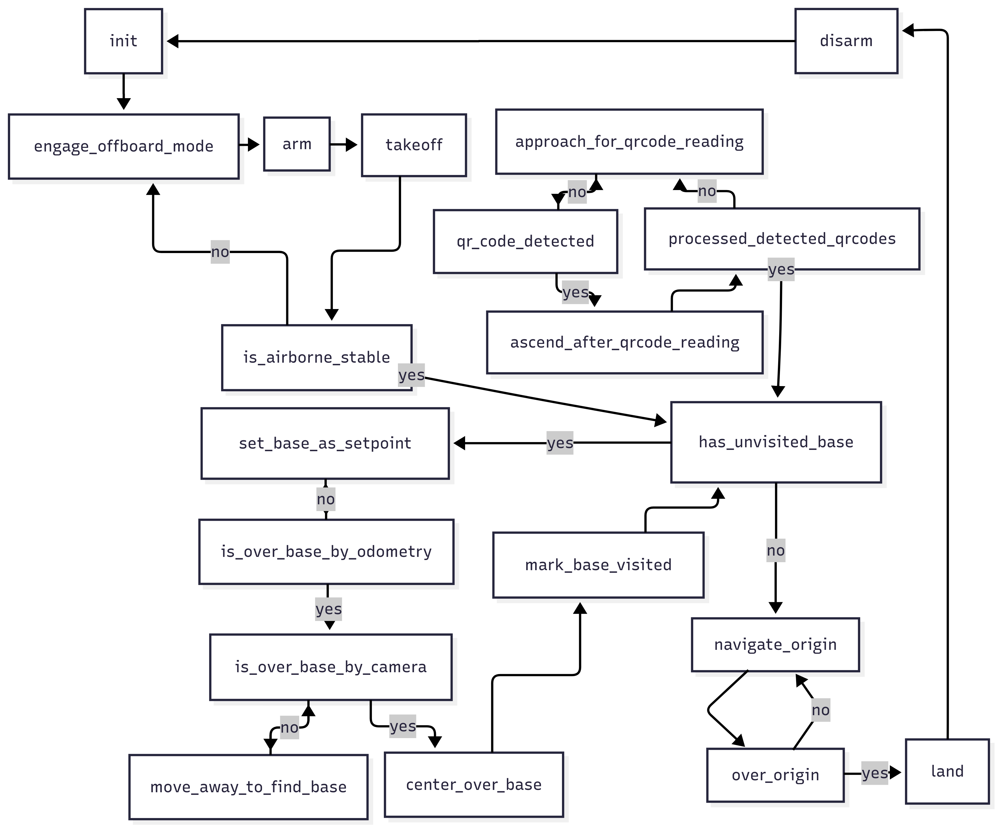
*Figure: A Finite State Machine for QR code detection and landing mission. This implementation has not been made available.*

##### Intelligent SLAM Calibration

Both GPS and SLAM positions are used for estimation, but these two methods can drift apart over time. The Intelligent SLAM Calibration component watches both data streams and, as new measurements arrive, remembers recent pairs of SLAM and GPS locations while throwing away duplicates or very old readings. Once it has enough good examples, it automatically computes the best scale, rotation, and shift linear transformation that aligns the SLAM map to the GPS frame. This is done with an iterative statistical fit that down-weights outliers and gives more importance to recent samples, so the UAV’s internal maps stay in sync with real-world coordinates throughout the flight.

##### Camera and perception

The ROS 2 node subscribes to the camera topic and uses CvBridge to convert incoming messages into OpenCV frames. A dedicated vision-estimate thread continuously processes each frame through a YOLO v8 model, drawing bounding boxes and motion vectors on live video (see [Perceptive Landing](#perceptive-landing)).

##### Real-Time Plotting

The MMS can launch a dedicated Matplotlib process for real-time plotting, it can be seen in figure [Figure](#fig-plotpan). In the top-left panel, it plots X–Y trajectories for GPS (blue), SLAM (red), and commanded setpoints (green), with current positions highlighted; in the top-right panel, it shows altitude versus time for those same data streams. Below the trajectory plot, a control-flag panel tracks when SLAM control, SLAM enable, and calibration modes are active, and two smaller panels display “time since last SLAM” and “time since last MAVLink” to catch stale data. Finally, a text panel in the right column continuously scrolls key diagnostics—error metrics, transform parameters, and timestamps.

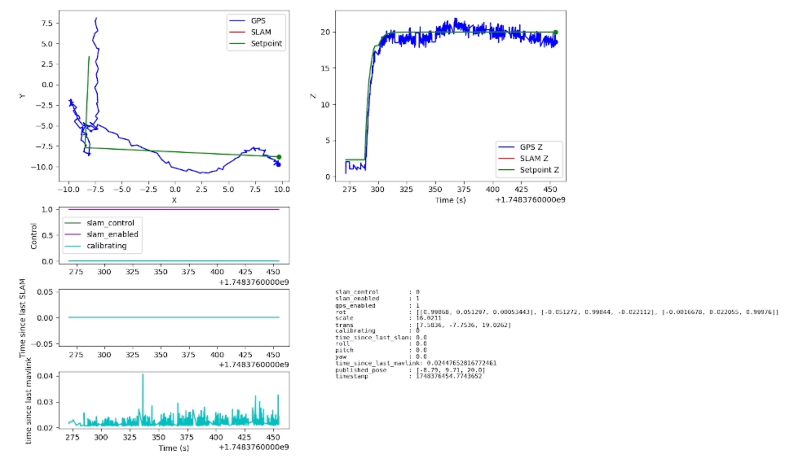
*Figure: Full Plotting Panel.*

##### Keyboard control interface

A non-blocking key capture thread uses termios to poll stdin, capturing single keystrokes without interrupting the mission loop. Keys toggle among GPS mode, calibration mode, SLAM calibrated control mode, and none; and “a/d/w/s” apply coarse latitude/longitude offsets. Each keystroke updates the PX4 position information for fusion.

### The SLAM subsystem

In /sitl/ORB\_SLAM3\_files/ORB\_SLAM3, the ORB-SLAM3 library was integrated as a submodule. It was selected as the SLAM solution for its popularity and the existence of community tutorials on how to use it. It supports monocular 3D SLAM with and without IMU or a depth camera. A modified version of the Pangolin library was forked and customized due to build issues in the default compiler version for Ubuntu 22.04.

A custom C++ ROS 2 node subscribes to live frames—either streamed from Gazebo via an image bridge or captured from a host USB camera—and optionally to IMU data. Incoming images are resized, cropped, timestamp-validated, and stored (up to five frames), while IMU messages (up to ten) are similarly buffered. Each frame (and its matching IMU sequence, if enabled) is fed into ORB-SLAM3, and resulting poses are published on a ROS 2 topic. In parallel, the node periodically serializes the full SLAM map point cloud to JSON for offline analysis.

ORB-SLAM3 is configured for processing 752x480 images (cut down from 1280x720 from the image feed using OpenCV) at 20 frames per second. Higher resolutions provide better results. The system stores 1200 visual features simultaneously. Empirically, using fewer features would cause maps to not effectively remember previously visited locations, while more features would cause the relocalization to consume excessive time and require multiple passes over previously visited regions. These configurations represent a compromise that preserves sufficient scene detail without overloading the CPU.

ORB-SLAM3’s parameters were determined through a combination of formal camera calibration (cf. Fig. [Figure](#fig-calibration)) and iterative tuning. A classical pinhole camera model—without radial or tangential distortion—projects 3D points onto the 2D image plane. The focal lengths (fx = 376, fy = 376) control magnification in the horizontal and vertical axes, while the principal point (cx = 375.87, cy = 240) specifies the optical center. For feature tracking, the ORB extractor retains keypoints detected across an eight-level image pyramid to capture both coarse and fine structures. FAST (see [Visual Features](#visual-features)) corner detection uses an initial threshold of 20 to select only the strongest corners, with a fallback minimum of 7 to ensure robustness in low-contrast regions. When enabled, IMU fusion relies on noise settings typically used on UAV sensors.

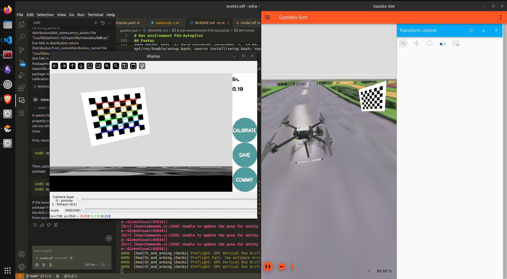
*Figure: Camera calibration using a checkerboard and ROS camera_calibration.*

IMU integration was also explored (see section [Limitations](#limitations)), though initialization proved challenging, and SLAM would never start operations while IMU data was being used. The system received IMU published measurements at 110 Hz from ROS 2. Configuration was performed, setting a camera-to-IMU transform (Tbc), a 4×4 matrix. Sensor noise characteristics, such as density and bias instabilities (or “walk”), were set for the gyroscope and accelerometer. Pure vision operation proved more reliable under the tested conditions.

A key limitation of this SLAM setup is the recovery time required whenever visual tracking is lost—typically because feature overlap from one frame to the next drops below usable thresholds. Whether caused by camera shake or rapid motion through new areas, the system will pause its GUI updates while it relocalizes. During this period, the vehicle must return to a well-mapped region and hover there until the SLAM engine regains sufficient feature continuity to resume pose estimation.

### Gazebo Models and Worlds

The Iris x500 depth quadcopter model is used as the default UAV in the simulation. It is a PX4-supported model with a realistic frame, motors, and sensors, and a depth camera. It is equipped with four brushless motors, each driving a propeller, and has a flight controller that runs the PX4 autopilot software.

Gazebo’s models directory, located in the /sitl/gz folder, is a collection of reusable SDF-based components—from sensors (lidars, cameras, IMUs) and robots (quadcopter frames like Iris, fixed-wing planes, and ground vehicles) to simple primitives (boxes, barrels, cones, checkerboards) and richly textured scene elements (trees, buildings, urban terrain, and ocean surfaces). Each model comes with its own model.config, .sdf, and any necessary meshes, textures, or materials.

In contrast, worlds (or maps; see section [Gazebo](#gazebo)) are SDF scenes that stitch together many of these individual models into a coherent environment. Examples include an empty world for pure sensor testing, an airport or Baylands Park in Los Angeles world to simulate outdoor flight over realistic terrain, an office or museum world for indoor SLAM demos, or specialized testbeds like random\_world and various practice fields for robotics challenges. By swapping worlds, the static layout of objects and terrain but also environmental parameters (gravity, lighting, wind). The models were collected from PX4 itself, from XTDrone (see [Xtdrone](#xtdrone)), and from the PX4 community. Some models were ported and made to work with an older Gazebo version.

### Ground Control Station

QGroundControl (see [Qgroundcontrol](#qgroundcontrol)) was leveraged for flight configurations. By updating the default parameters that come preloaded in the tool, behavior changes were caused in the UAV’s flight. One key change achieved was to interfere with and control the vision-based position estimates with changing flags EKF2\_GPS\_CTRL and EKF2\_EV\_CTRL, causing PX4 not to be controllable unless MMS injects a GPS value, ensuring the system can function without GPS. The settings were adjusted to increase the data rate PX4 produces and switch mode over UDP port for PX4 interception. The IMU update frequency was raised in the PX4 source to push IMU data at 110 Hz. The positive and negative signs of internal coordinate systems (the Y and Z axes) were flipped to test that offboard setpoints and SLAM-derived poses align correctly in simulation.

# Results

A complete UAV simulation and Mission Management System (MMS) were successfully integrated. End-to-end scenarios were developed to assess system capabilities and its current limitations.

Showcase video: <https://www.youtube.com/watch?v=UsiFUNniM68>

GitHub repository: <https://github.com/RenatoBrittoAraujo/GamaFlyware>

Docker Hub image: <https://hub.docker.com/r/renatobrittoaraujo/gamaflyware/tags>

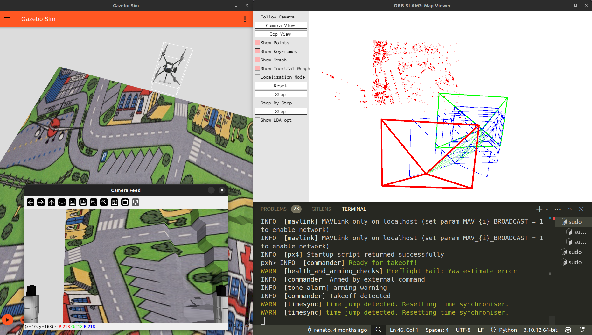
*Figure: Windows of GamaFlyware. On the top left, a Gazebo simulation with a custom map and UAV mid-flight; top right, ORB-SLAM3’s Map Viewer showing features detected in recent frames; bottom left, a camera’s frame streamed from the UAV; bottom right, a PX4 autopilot terminal.*

## Scenarios and Experiments

Multiple scenarios Missions were developed to be used with a simulation system to illustrate and evaluate different aspects of UAV autonomy, localization, and perception.

### Polygonal Setpoint Mission

A polygonal setpoint path navigation scenario was developed for testing the UAV’s SLAM navigation performance compared against a realistic location provided by simulated GPS. In its most essential form, the UAV is commanded to take off and fly in a triangular pattern, with each side measuring 10 meters. The mission starts with the UAV taking off to a height of 10 meters, then navigating through the three corners in an infinite loop.

The map is a simple flat surface textured as a children’s playground rug, which provides colorful high-contrast edges and corners for the SLAM system to locate visual features (see [Visual Features](#visual-features)).

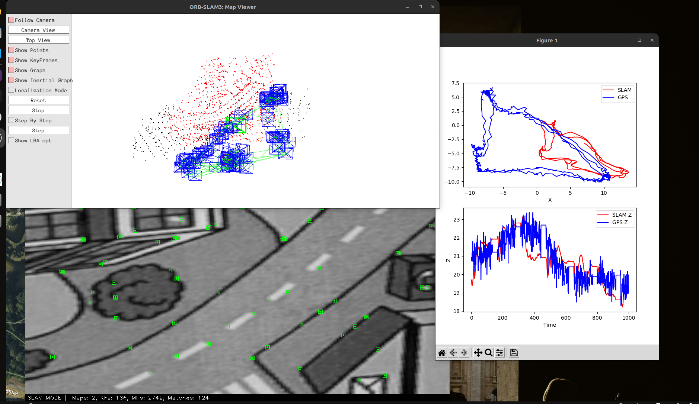
*Figure: Three‐point navigation map: In the top left, ORB-SLAM3 visualization with the map’s features present in the point cloud; in the top right, GPS versus SLAM XY trajectories; in the bottom left, a live camera frame showing collected visual features; in the bottom right, a line graph of GPS versus SLAM Z trajectories.*

A mismatch has been revealed between the positions the GPS provides and the positions the SLAM system estimates. See Figure [Figure](#fig-accaac).

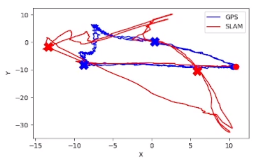
*Figure: The blue line represents the GPS XY trajectory, and the red line represents the SLAM’s counterpart.*

Due to scale invariance (see [Scale Invariance](#scale-invariance)), the scale from SLAM does not correspond to GPS, but the scale resembles the true trajectory because ORB-SLAM3 has been loaded with initial conditions that generate a reasonably accurate first scale guess. Some rotation can be observed between the two trajectories, which is caused by SLAM assuming the first few keyframes as the base for its internal reference system.

The shape of the trajectory does not match because the UAV’s camera rotates when the vehicle moves from one setpoint to the other, which causes distortions in the trajectory. This also causes the SLAM system to sometimes lose tracking and drift; it can recover from this failure state after some seconds, but in some situations it never recovers.

Furthermore, camera lens distortions (see [Camera Calibration](#camera-calibration)) cause some warping in the point cloud, adding a two-dimensional bend to otherwise flat surfaces.

The SLAM system is able to recover from these distortions and continue estimating the position of the UAV, but it takes time to do so. The UAV must hover over a previously visited region that is well mapped with visual features for it to start locating itself again.

### Control Integration Scenario

In this scenario, single-character commands are collected from user keyboard presses and drive the navigation switches between modes. These keyboard presses override incoming MAVLink `VISION_POSITION_ESTIMATE` and `GPS_RAW_INT` messages, allowing operators to interrupt or steer vision-based navigation without halting the mission loop. If messages are sent at a low frequency compared to PX4, they blend with existing PX4 MAVLink messages, causing the system position behavior to be erratic and to rely solely on VO/VIO or to crash if no alternative positioning mechanism is present.

The following modes are supported: GPS mode, in which read GPS positions are sent to MAVLink; SLAM mode, in which raw SLAM poses are sent to MAVLink; manual mode, in which “a/d/w/s” keys apply coarse latitude/longitude offsets controlling the vehicle; and none mode, in which PX4 and MAVLink are allowed to interact as normal.

Raw SLAM data cannot control the vehicle due to reasons presented in section [Polygonal Setpoint Mission](#polygonal-setpoint-mission), therefore a solution was proposed: to calibrate SLAM poses by applying a linear transformation to them before sending them to PX4. The MMS collects GPS and SLAM poses over time, computes the best-fit transformation, and applies it to future SLAM poses before sending them to PX4. Section [Calibration Experiment](#calibration-experiment) describes further developments.

### SLAM Calibration Experiment

This scenario runs the same keyboard input mission as in section [Control Integration](#control-integration), but it adds two new input modes for MAVLink messages: calibrated SLAM mode, in which SLAM poses are passed through a transformation and then sent, and calibration mode, in which SLAM poses get calibrated live before being sent.

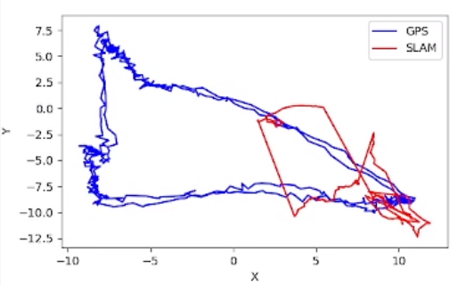
*Figure: Left: Before calibration. Right: After calibration.*

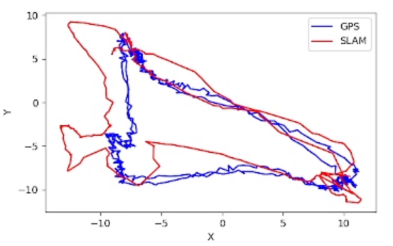
*Figure: Left: Before calibration. Right: After calibration.*

The calibration process uses a sliding-window IRLS with Huber weighting, as mentioned in [87](#ref-87), and exponential time decay to dynamically refine the similarity transform between SLAM and GPS coordinates. The calibration is performed by the MMS, which collects GPS and SLAM poses over time, computes the best-fit transformation, and applies it to future SLAM poses before sending them to PX4. The calibration is robust to noise, and it does account for the fact that SLAM poses may drift over time.

However, a fundamental flaw in the calibration mechanism is that it generates a transformation that overfits the most current SLAM point to the corresponding latest GPS point. It always generates the correct output because it always reads GPS data. If this calibration step is removed, the transformation slowly drifts over time.

Furthermore, the process is not perfect, and the calibration may not always yield a perfect match between GPS and SLAM coordinates. In practice, residual errors remain—typically in scale, rotation, or translation—because the calibration can overemphasize recent samples, GPS noise introduces outliers, and SLAM drift corrupts long-term consistency. When the sample window lacks spatial diversity (e.g., the vehicle moves mostly along one axis) or when measurement latency differs between sensors, the similarity transform can misalign certain axes.

Regardless, the calibration process is able to significantly improve the accuracy of SLAM poses, as shown in figure [Figure](#fig-before-after-calib). The left side shows the SLAM poses before calibration, while the right side shows the SLAM poses after calibration. The calibration process is able to reduce the error between GPS and SLAM poses, resulting in a more accurate trajectory. Correcting the SLAM calibration is left for future work. Future enhancements might include robust outlier rejection, adaptive window sizing, and regularization terms in the cost function to prevent overfitting and improve calibration stability.

### Full SLAM Control

This scenario, a continuation of section [Calibration Experiment](#calibration-experiment), disables GPS and lets the MMS drive the vehicle purely on ORB‐SLAM3 pose estimates. Full SLAM control fails because of a feedback loop: setpoint position and SLAM diverge, causing the vehicle to drift further away from the setpoint, which in turn causes the SLAM system to lose tracking and drift further away from the setpoint. The vehicle is unable to recover from this state, and it eventually crashes. Future works must further improve the SLAM system and MMS to enable full SLAM control.

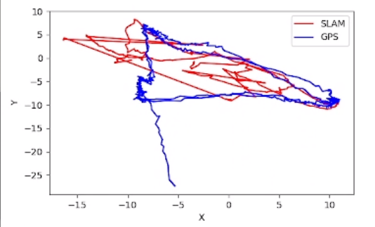
*Figure: Failed SLAM control.*

A proposed mitigation for this issue was proposed: to rely on an additional optical flow when the system loses tracking. It does not solve the problem but can filter out any uncertain decisions, leaving guidance up to SLAM only when it is confident that the vehicle is in a known location, which therefore would enable if to move in the correct direction, achieving mission objectives. This would allow the UAV to stop and wait for more visual features but could not address the underlying issue if SLAM can never recover. However, this was not implemented in time for the current version of the MMS and is left for future work.

From a more practical standpoint, SLAM recovery was further improved, enabling map saving. ORB-SLAM3 naturally crashes after the process has been running for too long, especially when it loses tracking, but the MMS can save the current map to a file before this happens. This allows ORB-SLAM to quickly reload the map and continue from where it left off, instead of starting from scratch. Over time, this allows the UAV to build a more complete map of the environment, improving chances of successful navigation and recovery.

### SLAM Path Following

A map called indoor4 (Figure [Figure](#fig-coool)), converted from XTDrone (model information in section [Gazebomodels](#gazebomodels)), was used for a surveillance and mapping mission using ORB-SLAM3.

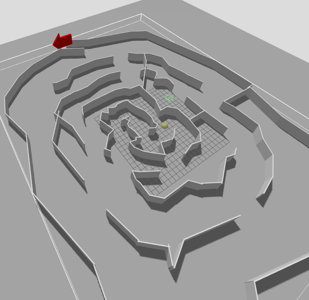
*Figure: Left: The indoor4 map. Right: ORB-SLAM3 detecting corners and edges (see visual features, Section).*

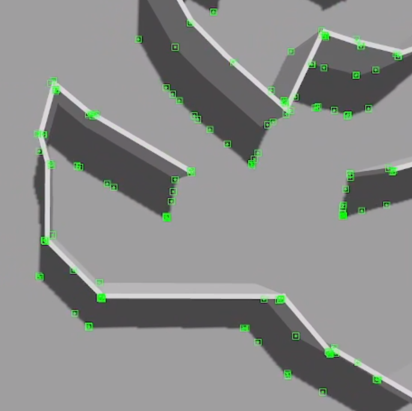
*Figure: Left: The indoor4 map. Right: ORB-SLAM3 detecting corners and edges (see visual features, Section).*

A zig-zag mapping path scenario was developed to test SLAM robustness with the map-saving feature added in section [Full Slam Only Control](#full-slam-only-control). At any one image, the UAV can never capture the entire map, so it must remember previously visited locations to be able to localize. The UAV flies slowly, with a smoothed-out motion, so SLAM never loses tracking. After successive passes over the same region, SLAM was capable of building a more complete map of the environment. The map used also revealed a two-layer structure, with a floor and walls.

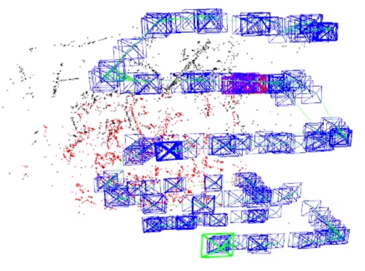
*Figure: Left: The indoor4 map. Right: ORB-SLAM3 detecting corners and edges (see visual features, Section).*

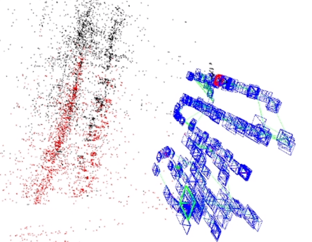
*Figure: Left: The indoor4 map. Right: ORB-SLAM3 detecting corners and edges (see visual features, Section).*

### Point Cloud Processing

The point cloud, from section [Spf](#spf), was then processed to create a histogram (Figure [Figure](#fig-okokhist)) of the Z-axis values, which represents the height of the points in the map. An XY scatter plot was created using filtered-out points below a height threshold of 0.7 units for removing noise or irrelevant ground points from the point cloud. Because with a monocular camera the absolute scale is unknown, these units are just arbitrary SLAM units determined up to an unknown scale factor; see [Scale Invariance](#scale-invariance).

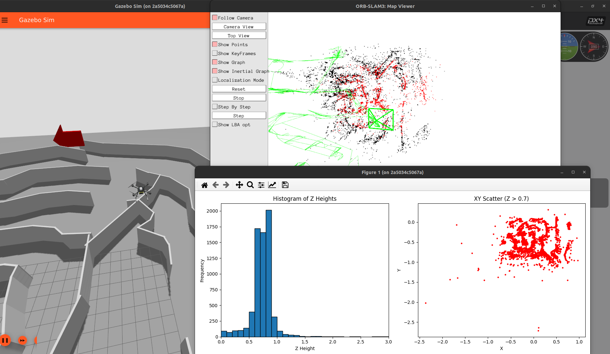
*Figure: On the left, the histogram containing the height of all points, in SLAM-generated units. On the right, the filtered point cloud is projected into an XY scatter plot showing the walls of the original map.*

### Structure Mapping

A structure was mapped by tracking visuals while it flew around the structure, capturing images of the walls and corners. The UAV was able to build a point cloud of the structure, demonstrating the system is capable of surveillance.

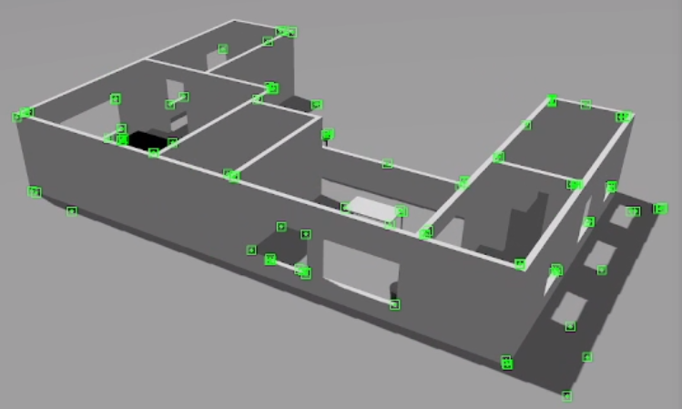
*Figure: Left: The indoor2 map. Right: mapping the structure.*

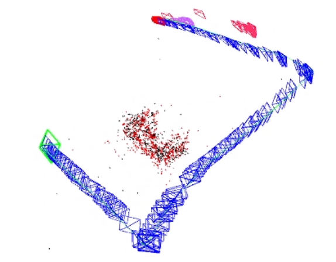
*Figure: Left: The indoor2 map. Right: mapping the structure.*

### Perceptive Landing

This scenario leverages the MMS and onboard image processing to execute a closed-loop surveillance-and-landing mission. First, the UAV ascends to a predetermined hover altitude under MMS control. Once stabilized, the vision pipeline analyzes camera frames in real time to detect the landing pad’s visual signature via an image detection ML algorithm. A vector is then drawn from the center of the image to the center of the landing pad. Then, the MMS computes and issues position setpoints, smoothly moving across the vector, guiding the vehicle laterally and vertically toward the pad. Finally, the UAV descends and touches down autonomously. A custom finite state machine was developed to handle this mission, referenced in figure [Figure](#fig-landingfsm).

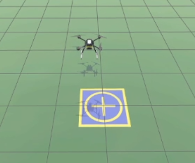
*Figure: Left: The indoor4 map. Right: ORB-SLAM3 detecting corners and edges (see visual features, Section).*

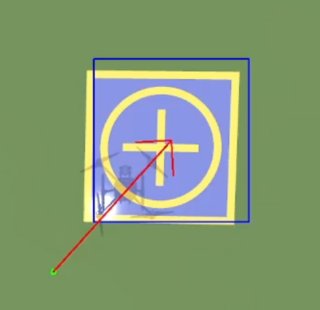
*Figure: Left: The indoor4 map. Right: ORB-SLAM3 detecting corners and edges (see visual features, Section).*

## Limitations

A software platform works, however, it does exhibit limitations in its current state. Even on powerful hosts with a dedicated GPU, Gazebo’s physics simulation and ORB-SLAM3’s feature tracking compete for compute resources. This contention leads to dropped frames, missed control deadlines (see section [Time Decision](#time-decision)), and drift in the PX4 EKF. In practice, there are jerky commands, delayed setpoints, and mission-loop overruns that force repeated retries (see Figure [Figure](#fig-ba1) and Figure [Figure](#fig-ba2)). Future work may profile these hotspots, throttle SLAM frame rates, or introduce lightweight inertial fallbacks to reduce real-time strain.

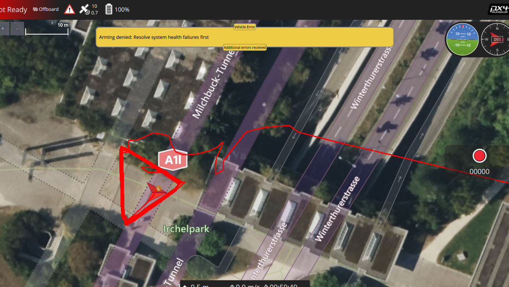
*Figure: XY plot from QGroundControl depicting a fly-away UAV failure state. Left: initial loss of control. Right: UAV crossing Europe within simulation.*

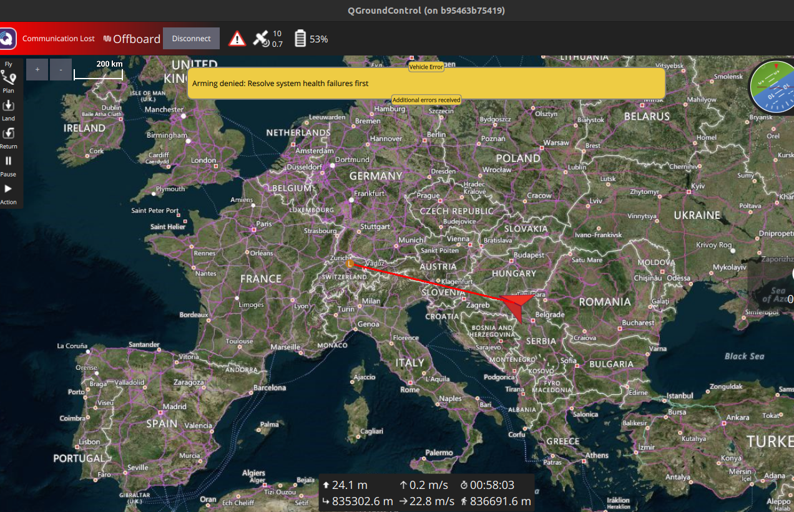
*Figure: XY plot from QGroundControl depicting a fly-away UAV failure state. Left: initial loss of control. Right: UAV crossing Europe within simulation.*

The MMS FSM also exhibits reliability issues under high load or transient communication glitches. In these situations the UAV may hover indefinitely, attempt repeated takeoffs, or even enter a fly-away state where control inputs are ignored. These failures often arise from timing mismatches in communication loop frequencies. Increasing frequency of communication might solve the problem, but a deeper diagnostic would be required to root out a cause.

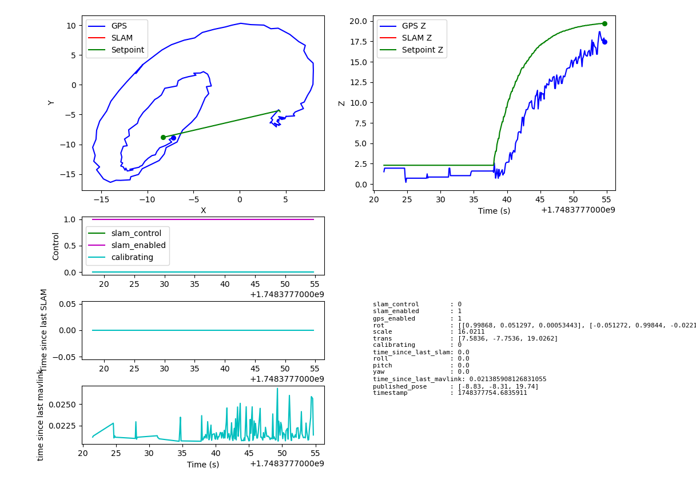
*Figure: XY plot showing UAV’s bad takeoff attempt within limited computational resources leading to late guidance commands.*

Some third-party dependencies also present challenges. ORB-SLAM3, for instance, has a tendency to crash after extended runs—likely because we’re using an older, pinned version for compatibility. Upgrading to the latest ORB-SLAM3 release (and its updated Pangolin/Eigen toolchain) would likely improve stability, though it would require revalidating the entire SLAM pipeline within our Docker environment.

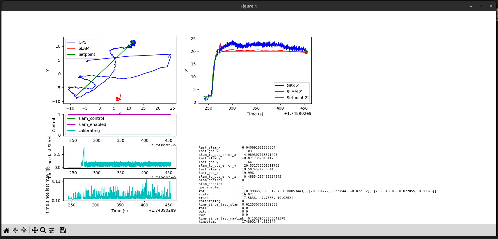
*Figure: XY plot showing UAV’s jerky motion when following the setpoint.*

Finally, monocular SLAM itself struggles in low-texture or rapidly changing environments. When ORB-SLAM3 loses feature tracking—due to fast maneuvers, poor lighting, or lack of visual detail—it can take several seconds of hovering before relocalizing, if it recovers at all. During this outage, the EKF diverges, and the UAV may drift far off course, making fully vision-only control untenable without a secondary pose source.

## Extending the System

GamaFlyware’s modular architecture makes it straightforward to add modules, switch out existing modules for others, and even delete unwanted software. This would enable adding mission replay and automated testing. By recording all relevant data, such as /orbslam3/pose and camera streams, to ROS bag files, it would be possible to deterministically replay complex flights offline to compare control commands suggested by one version against the original. Embedding these bag replays into a continuous integration pipeline allows testing the performance metrics on every code change, catching regressions early, and ensuring long-term stability of the MMS.

On the perception side, any SLAM engine or vision algorithm can be slotted in without touching the core SITL stack: simply write a new ROS 2 node that subscribes to /camera and publishes PoseStamped poses (for SLAM), optical-flow vectors, or object detections. This plugin-style approach enables experimentation with monocular, stereo, depth-camera, or visual-inertial odometry.

Looking beyond simulation, the solution can aid in deployment on a real UAV (for instance, Pixhawk plus a Raspberry Pi) or integrate additional SLAM libraries (such as RTAB-Map or VINS-Fusion) or IMU for robustness in textureless or GPS-denied environments.

GamaFlyware could be extended to scale from a single quadrotor to heterogeneous multi-vehicle simulations. By spawning multiple vehicle models (fixed-wings, ground rovers, even submarines) and assigning each its own ROS 2 namespace and unique MAVLink system ID.

## Challenges and Lessons Learned

Development presented multiple unexpected roadblocks. Reconciling libraries and tool versions proved more difficult than anticipated, and containerizing the entire stack in Docker—with meticulously pinned package versions—was the only way to achieve a stable, reproducible environment. The Docker container has ballooned to more than 120 GB, requiring image optimization. Tuning PX4’s EKF2 parameters to disable GPS fusion and accept vision estimates required long exploration in documentation for the correct parameters to enable offboard pose control. The process of launching six interdependent terminals outlined the need for tools to have usage simplified by the creation of unified launch scripts and recording usage. Building ORB-SLAM3 required downgrading to an older version with a documented build process, and attempts to inject high-rate IMU data proved too challenging for this work because of interfacing difficulties and subtle timestamp mismatches. Alternative SLAM integrations may provide an easier out-of-the-box experience. The computational resources required for development of the solution were high, directly impacting difficulty in producing the expected program behavior.

# Conclusion

This work presented GamaFlyware—a fully containerized, open-source platform that seamlessly integrates Gazebo, PX4, ROS2̃, ORB‑SLAM3, and a Python-based Mission Management System into a single, reproducible Ubuntu Docker image. By eliminating the common installation and versioning challenges, GamaFlyware significantly reduces the entry barrier for developers beginning work in autonomous UAV systems.

Through a series of experiments, we demonstrated that the Mission Management System can: (i) autonomously navigate complex indoor environments using GPS while building maps with SLAM; (ii) perform online calibration to correct SLAM drift using GPS, maintaining alignment between global and local frames; and (iii) execute full perception-control loops for visual landing on designated pads.

Performance on modern consumer laptops proved satisfactory for real-time operation. However, stress tests revealed key limitations—namely, occasional bottlenecks in ORB‑SLAM3 relocalization and sporadic timing overruns in the mission loop. These findings underscore the importance of improving computational efficiency and introducing fallback mechanisms such as inertial odometry in future iterations. GamaFlyware provides a solid foundation for further extensions, including automated validation via ROS bag replay, multi-UAV coordination capabilities, and integration with physical hardware for real-world deployment.

## References

1. Elchin, Mammadov (2013). Long-range communication framework for autonomous UAVs. University of Ottawa (Canada). [Link](https://scholar.google.com/scholar?q=Long-range+communication+framework+for+autonomous+UAVs)

2. Matolak, David W (2015). Unmanned aerial vehicles: Communications challenges and future aerial networking. 2015 International Conference on Computing, Networking and Communications (ICNC). [Link](https://scholar.google.com/scholar?q=Unmanned+aerial+vehicles%3A+Communications+challenges+and+future+aerial+networking)

3. Li, Xuejun et al. (2022). Solving the last mile problem in logistics: A mobile edge computing and blockchain-based unmanned aerial vehicle delivery system. Concurrency and Computation: Practice and Experience. [Link](https://scholar.google.com/scholar?q=Solving+the+last+mile+problem+in+logistics%3A+A+mobile+edge+computing+and+blockchain-based+unmanned+aerial+vehicle+delivery+system)

4. Husain, Zainab et al. (2022). Search and rescue in a maze-like environment with ant and dijkstra algorithms. Drones. [Link](https://scholar.google.com/scholar?q=Search+and+rescue+in+a+maze-like+environment+with+ant+and+dijkstra+algorithms)

5. Gu, Jingjing et al. (2018). Multiple moving targets surveillance based on a cooperative network for multi-UAV. IEEE Communications Magazine. [Link](https://scholar.google.com/scholar?q=Multiple+moving+targets+surveillance+based+on+a+cooperative+network+for+multi-UAV)

6. Zaheer, Zainab et al. (2016). Aerial surveillance system using UAV. 2016 thirteenth international conference on wireless and optical communications networks (WOCN). [Link](https://scholar.google.com/scholar?q=Aerial+surveillance+system+using+UAV)

7. Zhou, Yongkun et al. (2020). UAV swarm intelligence: Recent advances and future trends. Ieee Access. [Link](https://scholar.google.com/scholar?q=UAV+swarm+intelligence%3A+Recent+advances+and+future+trends)

8. Chen, Xi et al. (2020). Review of unmanned aerial vehicle swarm communication architectures and routing protocols. Applied Sciences. [Link](https://scholar.google.com/scholar?q=Review+of+unmanned+aerial+vehicle+swarm+communication+architectures+and+routing+protocols)

9. Du, Fei et al. (2024). Exploiting the Vulnerabilities in MAVLink Protocol for UAV Hijacking. 2024 17th International Conference on Security of Information and Networks (SIN). [Link](https://doi.org/10.1109/SIN63213.2024.10871546)

10. Pope, Adrian P. et al. (2021). Hierarchical Reinforcement Learning for Air-to-Air Combat. 2021 International Conference on Unmanned Aircraft Systems (ICUAS). [Link](https://doi.org/10.1109/ICUAS51884.2021.9476700)

11. International Micro Air Vehicle Conference and Competition (2022). IMAVS - International Micro Air Vehicle Conference and Competition. https://www.imavs.org/. [Link](https://www.imavs.org/)

12. Competição Brasileira de Robótica (2024). Competição Brasileira de Robótica. https://cbr.robocup.org.br/. [Link](https://cbr.robocup.org.br/)

13. SAE Brasil's Eletroquad (2025). Eletroquad - Programa Estudantil. https://saebrasil.org.br/programas-estudantis/eletroquad/. [Link](https://saebrasil.org.br/programas-estudantis/eletroquad/)

14. Embraer (2025). Embraer - Global Aerospace Company. https://embraer.com/. [Link](https://embraer.com/)

15. Quan, Quan (2017). Introduction to multicopter design and control. Springer. [Link](https://scholar.google.com/scholar?q=Introduction+to+multicopter+design+and+control)

16. Valavanis, Kimon P and Vachtsevanos, George J (2014). Handbook of unmanned aerial vehicles. Springer Publishing Company, Incorporated. [Link](https://scholar.google.com/scholar?q=Handbook+of+unmanned+aerial+vehicles)

17. Xiao, Kun et al. (2020). XTDrone: A customizable multi-rotor UAVs simulation platform. 2020 4th International Conference on Robotics and Automation Sciences (ICRAS). [Link](https://scholar.google.com/scholar?q=XTDrone%3A+A+customizable+multi-rotor+UAVs+simulation+platform)

18. Saavedra-Ruiz, Miguel et al. (2021). Monocular visual autonomous landing system for quadcopter drones using software in the loop. IEEE Aerospace and Electronic Systems Magazine. [Link](https://scholar.google.com/scholar?q=Monocular+visual+autonomous+landing+system+for+quadcopter+drones+using+software+in+the+loop)

19. Güray SONUGÜR (2023). A Review of quadrotor UAV: Control and SLAM methodologies ranging from conventional to innovative approaches. Robotics and Autonomous Systems. [Link](https://www.sciencedirect.com/science/article/pii/S0921889022002317)

20. Xiao, Kun et al. (2022). Implementation of uav coordination based on a hierarchical multi-uav simulation platform. Advances in Guidance, Navigation and Control: Proceedings of 2020 International Conference on Guidance, Navigation and Control, ICGNC 2020, Tianjin, China, October 23--25, 2020. [Link](https://scholar.google.com/scholar?q=Implementation+of+uav+coordination+based+on+a+hierarchical+multi-uav+simulation+platform)

21. Labb\'e, Mathieu and Michaud, Fran (2019). RTAB-Map as an open-source lidar and visual simultaneous localization and mapping library for large-scale and long-term online operation. Journal of field robotics. [Link](https://scholar.google.com/scholar?q=RTAB-Map+as+an+open-source+lidar+and+visual+simultaneous+localization+and+mapping+library+for+large-scale+and+long-term+online+operation)

22. Rold\'an, Juan Jes\'us et al. (2015). A proposal of methodology for multi-UAV mission modeling. 2015 23rd Mediterranean Conference on Control and Automation (MED). [Link](https://scholar.google.com/scholar?q=A+proposal+of+methodology+for+multi-UAV+mission+modeling)

23. Wang, Huan and Wang, Jintao (2024). Enhancing multi-UAV air combat decision making via hierarchical reinforcement learning. Scientific Reports. [Link](https://scholar.google.com/scholar?q=Enhancing+multi-UAV+air+combat+decision+making+via+hierarchical+reinforcement+learning)

24. Mahmoud Zadeh, Somaiyeh et al. (2019). Autonomy and unmanned vehicles. Cognitive science and technology. Springer. [Link](https://scholar.google.com/scholar?q=Autonomy+and+unmanned+vehicles)

25. Elmokadem, Taha and Savkin, Andrey V (2021). Towards fully autonomous UAVs: A survey. Sensors. [Link](https://scholar.google.com/scholar?q=Towards+fully+autonomous+UAVs%3A+A+survey)

26. Franklin, Gene F et al. (2010). Feedback control of dynamic systems. Pearson Upper Saddle River, NJ. [Link](https://scholar.google.com/scholar?q=Feedback+control+of+dynamic+systems)

27. Lopez-Sanchez, Ivan and Moreno-Valenzuela, Javier (2023). PID control of quadrotor UAVs: A survey. Annual Reviews in Control. [Link](https://scholar.google.com/scholar?q=PID+control+of+quadrotor+UAVs%3A+A+survey)

28. Dewesoft (2025). What is PID Controller?. https://dewesoft.com/blog/what-is-pid-controller. [Link](https://dewesoft.com/blog/what-is-pid-controller)

29. Jing, Yutao et al. (2022). PX4 simulation results of a quadcopter with a disturbance-observer-based and PSO-optimized sliding mode surface controller. Drones. [Link](https://scholar.google.com/scholar?q=PX4+simulation+results+of+a+quadcopter+with+a+disturbance-observer-based+and+PSO-optimized+sliding+mode+surface+controller)

30. Timothy, D Barfoot (2018). State Estimation for Robotics. Cambridge University Press: Cambridge, Britain. [Link](https://scholar.google.com/scholar?q=State+Estimation+for+Robotics)

31. Juan-Carlos Trujillo et al. (2025). Control and monocular visual SLAM of nonholonomic mobile robots. European Journal of Control. [Link](https://www.sciencedirect.com/science/article/pii/S0947358024002310)

32. Yuncheng Lu, Zhucun Xue, Gui-Song Xia and Liangpei Zhang (2018). A survey on vision-based UAV navigation. Geo-spatial Information Science. [Link](https://doi.org/10.1080/10095020.2017.1420509)

33. He, Ming et al. (2020). A review of monocular visual odometry. The Visual Computer. [Link](https://scholar.google.com/scholar?q=A+review+of+monocular+visual+odometry)

34. Scaramuzza, Davide and Zhang, Zichao (2019). Visual-inertial odometry of aerial robots. arXiv preprint arXiv:1906.03289. [Link](https://scholar.google.com/scholar?q=Visual-inertial+odometry+of+aerial+robots)

35. Zhuang, Licong et al. (2024). Visual SLAM for Unmanned Aerial Vehicles: Localization and Perception. Sensors. [Link](https://www.mdpi.com/1424-8220/24/10/2980)

36. Marvelmind Robotics (2025). Indoor positioning solutions for autonomous drones. https://marvelmind.com/drones/. [Link](https://marvelmind.com/drones/)

37. OptiTrack (2025). OptiTrack. https://www.optitrack.com/. [Link](https://www.optitrack.com/)

38. Yingxiu Chang et al. (2023). A review of UAV autonomous navigation in GPS-denied environments. Robotics and Autonomous Systems. [Link](https://www.sciencedirect.com/science/article/pii/S0921889023001720)

39. Qin, Tong et al. (2019). A general optimization-based framework for global pose estimation with multiple sensors. arXiv preprint arXiv:1901.03642. [Link](https://scholar.google.com/scholar?q=A+general+optimization-based+framework+for+global+pose+estimation+with+multiple+sensors)

40. Mir, Imran et al. (2022). A Survey of Trajectory Planning Techniques for Autonomous Systems. Electronics. [Link](https://www.mdpi.com/2079-9292/11/18/2801)

41. Dupeng Cai et al. (2024). A comprehensive overview of core modules in visual SLAM framework. Neurocomputing. [Link](https://www.sciencedirect.com/science/article/pii/S0925231224005319)

42. OpenCV (2025). OpenCV Library. https://github.com/opencv/opencv. [Link](https://github.com/opencv/opencv)

43. Peres, Michael (2017). Digital Cameras, Digital Images, and Strategies. Laboratory Imaging & Photography. [Link](https://scholar.google.com/scholar?q=Digital+Cameras%2C+Digital+Images%2C+and+Strategies)

44. Zhang, Zhengyou (2021). Camera calibration. Computer vision: a reference guide. [Link](https://scholar.google.com/scholar?q=Camera+calibration)

45. J. Maye et al. (2013). Self-supervised Calibration for Robotic Systems. Proceedings of the IEEE Intelligent Vehicles Symposium (IVS). [Link](https://scholar.google.com/scholar?q=Self-supervised+Calibration+for+Robotic+Systems)

46. ROS (2025). camera_calibration. http://wiki.ros.org/camera_calibration. [Link](http://wiki.ros.org/camera_calibration)

47. Luo, Jingwen and Qin, Shiyin (2023). An Interval SLAM Algorithm for Leg-Arm Mobile Robot Based on CBMeMBer Filter with Gaussian Indicator Box Particles. Measurement Science and Technology. [Link](https://doi.org/10.1088/1361-6501/accebf)

48. Chien, Hsiang-Jen et al. (2016). When to use what feature? SIFT, SURF, ORB, or A-KAZE features for monocular visual odometry. 2016 International Conference on Image and Vision Computing New Zealand (IVCNZ). [Link](https://scholar.google.com/scholar?q=When+to+use+what+feature%3F+SIFT%2C+SURF%2C+ORB%2C+or+A-KAZE+features+for+monocular+visual+odometry)

49. Nanonets (2025). Optical Flow. https://nanonets.com/blog/optical-flow/. [Link](https://nanonets.com/blog/optical-flow/)

50. Quanser (2025). Real-Time Appearance-Based Mapping Using ROS and an RGBD Camera. https://www.quanser.com/blog/autonomous-systems/real-time-appearance-based-mapping-using-ros-and-an-rgbd-camera/. [Link](https://www.quanser.com/blog/autonomous-systems/real-time-appearance-based-mapping-using-ros-and-an-rgbd-camera/)

51. Thrun, Sebastian and others (2002). Robotic mapping: A survey. School of Computer Science, Carnegie Mellon University Pittsburgh. [Link](https://scholar.google.com/scholar?q=Robotic+mapping%3A+A+survey)

52. Matsuki, Hidenobu et al. (2021). CodeMapping: Real-Time Dense Mapping for Sparse SLAM using Compact Scene Representations. IEEE Robotics and Automation Letters. [Link](https://doi.org/10.1109/LRA.2021.3097258)

53. Elfes, Alberto (2002). Using occupancy grids for mobile robot perception and navigation. Computer. [Link](https://scholar.google.com/scholar?q=Using+occupancy+grids+for+mobile+robot+perception+and+navigation)

54. Hornung, Armin et al. (2013). OctoMap: An efficient probabilistic 3D mapping framework based on octrees. Autonomous robots. [Link](https://scholar.google.com/scholar?q=OctoMap%3A+An+efficient+probabilistic+3D+mapping+framework+based+on+octrees)

55. McCormac, John et al. (2017). Semanticfusion: Dense 3d semantic mapping with convolutional neural networks. 2017 IEEE International Conference on Robotics and automation (ICRA). [Link](https://scholar.google.com/scholar?q=Semanticfusion%3A+Dense+3d+semantic+mapping+with+convolutional+neural+networks)

56. Campos, Carlos et al. (2021). Orb-slam3: An accurate open-source library for visual, visual--inertial, and multimap slam. IEEE Transactions on Robotics. [Link](https://scholar.google.com/scholar?q=Orb-slam3%3A+An+accurate+open-source+library+for+visual%2C+visual--inertial%2C+and+multimap+slam)

57. Marzorati, Daniele et al. (2009). On the use of inverse scaling in monocular SLAM. 2009 IEEE International Conference on Robotics and Automation. [Link](https://doi.org/10.1109/ROBOT.2009.5152640)

58. N\"utzi, Gabriel et al. (2011). Fusion of IMU and vision for absolute scale estimation in monocular SLAM. Journal of intelligent & robotic systems. [Link](https://scholar.google.com/scholar?q=Fusion+of+IMU+and+vision+for+absolute+scale+estimation+in+monocular+SLAM)

59. Agostino Martinelli et al. (2007). A relative map approach to SLAM based on shift and rotation invariants. Robotics and Autonomous Systems. [Link](https://www.sciencedirect.com/science/article/pii/S0921889006001473)

60. He, Yong et al. (2021). Deep learning based 3D segmentation: A survey. arXiv preprint arXiv:2103.05423. [Link](https://scholar.google.com/scholar?q=Deep+learning+based+3D+segmentation%3A+A+survey)

61. Kurunathan, Harrison et al. (2023). Machine learning-aided operations and communications of unmanned aerial vehicles: A contemporary survey. IEEE Communications Surveys & Tutorials. [Link](https://scholar.google.com/scholar?q=Machine+learning-aided+operations+and+communications+of+unmanned+aerial+vehicles%3A+A+contemporary+survey)

62. Kapania, Shivani et al. (2020). Multi object tracking with UAVs using deep SORT and YOLOv3 RetinaNet detection framework. Proceedings of the 1st ACM Workshop on Autonomous and Intelligent Mobile Systems. [Link](https://scholar.google.com/scholar?q=Multi+object+tracking+with+UAVs+using+deep+SORT+and+YOLOv3+RetinaNet+detection+framework)

63. Majidizadeh, A et al. (2023). Semantic segmentation of UAV images based on U-NET in urban area. ISPRS Annals of the Photogrammetry, Remote Sensing and Spatial Information Sciences. [Link](https://scholar.google.com/scholar?q=Semantic+segmentation+of+UAV+images+based+on+U-NET+in+urban+area)

64. MahmoudZadeh, Somaiyeh et al. (2019). State-of-the-art in UVs’ autonomous mission planning and task managing approach. Autonomy and Unmanned Vehicles: Augmented Reactive Mission and Motion Planning Architecture. [Link](https://scholar.google.com/scholar?q=State-of-the-art+in+UVs%E2%80%99+autonomous+mission+planning+and+task+managing+approach)

65. Adolf, Florian and Thielecke, Frank (2007). A Sequence Control System for Onboard Mission Management of an Unmanned Helicopter. [Link](https://doi.org/10.2514/6.2007-2769)

66. Iovino, Matteo et al. (2024). Comparison between Behavior Trees and Finite State Machines. arXiv preprint arXiv:2405.16137. [Link](https://scholar.google.com/scholar?q=Comparison+between+Behavior+Trees+and+Finite+State+Machines)

67. Winfield, Alan (2009). Foraging Robots. [Link](https://doi.org/10.1007/978-0-387-30440-3_217)

68. ROS2JsGuy (2025). Autonomous Drone Flight with Behavior Trees, AirSim-js and Nodejs. https://ros2jsguy.medium.com/autonomous-drone-flight-with-behavior-trees-airsim-js-and-nodejs-8f11f55e7d7a. [Link](https://ros2jsguy.medium.com/autonomous-drone-flight-with-behavior-trees-airsim-js-and-nodejs-8f11f55e7d7a)

69. Chen, Shengyang et al. (2022). An end-to-end UAV simulation platform for visual SLAM and navigation. Aerospace. [Link](https://scholar.google.com/scholar?q=An+end-to-end+UAV+simulation+platform+for+visual+SLAM+and+navigation)

70. Nathan Koenig and Andrew Howard (2004). Design and Use Paradigms for Gazebo, An Open-Source Multi-Robot Simulator. IEEE/RSJ International Conference on Intelligent Robots and Systems. [Link](https://scholar.google.com/scholar?q=Design+and+Use+Paradigms+for+Gazebo%2C+An+Open-Source+Multi-Robot+Simulator)

71. Cavalli, Alessandro (2024). Development of a simulation environment for precision agriculture applications with Unmanned Aircraft Systems. Politecnico di Torino. [Link](https://scholar.google.com/scholar?q=Development+of+a+simulation+environment+for+precision+agriculture+applications+with+Unmanned+Aircraft+Systems)

72. Mavlink (2025). QGroundControl. https://github.com/mavlink/qgroundcontrol. [Link](https://github.com/mavlink/qgroundcontrol)

73. PX4-Autopilot (2025). PX4-Autopilot. https://docs.px4.io/main/en/. [Link](https://docs.px4.io/main/en/)

74. PX4 Documentation (2025). PX4 Architecture. https://docs.px4.io/main/en/concept/architecture.html. [Link](https://docs.px4.io/main/en/concept/architecture.html)

75. Unknown author (n.d.). MAVLink_packet. [Link](https://scholar.google.com/scholar?q=MAVLink_packet)

76. Quigley, Morgan et al. (2009). ROS: an open-source Robot Operating System. ICRA workshop on open source software. [Link](https://scholar.google.com/scholar?q=ROS%3A+an+open-source+Robot+Operating+System)

77. Heath, Steve (2002). Embedded systems design. Elsevier. [Link](https://scholar.google.com/scholar?q=Embedded+systems+design)

78. Eliasz, Andrew (2024). A Review of RTOS Fundamentals. Zephyr RTOS Embedded C Programming: Using Embedded RTOS POSIX API. [Link](https://scholar.google.com/scholar?q=A+Review+of+RTOS+Fundamentals)

79. Reghenzani, Federico et al. (2019). The real-time linux kernel: A survey on preempt_rt. ACM Computing Surveys (CSUR). [Link](https://scholar.google.com/scholar?q=The+real-time+linux+kernel%3A+A+survey+on+preempt_rt)

80. Chen, Shengyang et al. (2023). Stereo Visual Inertial Pose Estimation Based on Feedforward and Feedbacks. IEEE/ASME Transactions on Mechatronics. [Link](https://doi.org/10.1109/TMECH.2023.3272208)

81. Docker (2025). Docker - Empowering App Development for Developers. https://www.docker.com/. [Link](https://www.docker.com/)

82. Docker Documentation (2025). Docker Documentation. https://docs.docker.com/. [Link](https://docs.docker.com/)

83. Schmittle, Matt et al. (2018). OpenUAV: A UAV testbed for the CPS and robotics community. 2018 ACM/IEEE 9th International Conference on Cyber-Physical Systems (ICCPS). [Link](https://scholar.google.com/scholar?q=OpenUAV%3A+A+UAV+testbed+for+the+CPS+and+robotics+community)

84. GitHub Search (2025). GitHub Search. https://github.com/search. [Link](https://github.com/search)

85. SourceGraph (2025). SourceGraph Public Code Search. https://sourcegraph.com. [Link](https://sourcegraph.com)

86. RTAB-Map Docker Environment (2025). RTAB-Map Drone Example. https://github.com/matlabbe/rtabmap_drone_example. [Link](https://github.com/matlabbe/rtabmap_drone_example)

87. Dexheimer, Eric and Davison, Andrew J (2024). COMO: Compact mapping and odometry. European Conference on Computer Vision. [Link](https://scholar.google.com/scholar?q=COMO%3A+Compact+mapping+and+odometry)
